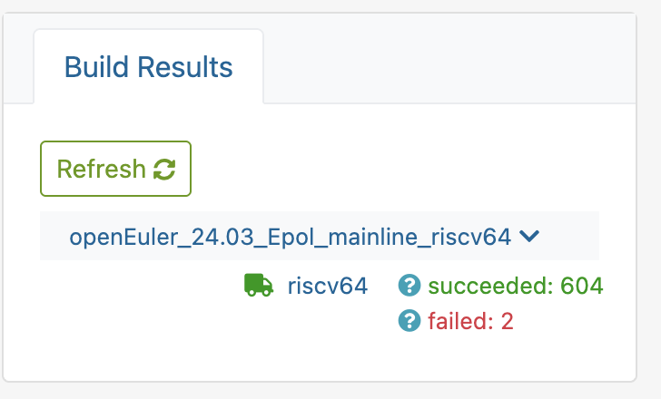
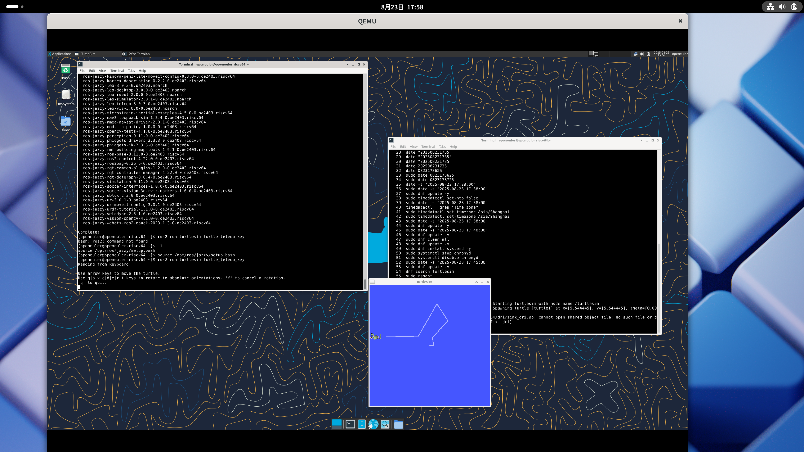
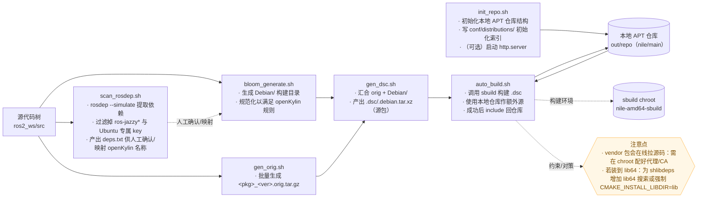

# 八月产出

> 本月主要产出为跑起来 openEuler 24.03 Risc-V Jazzy 小乌龟与 openkylin 2.0 sp1 x86 Jazzy 小乌龟。

## openEuler

打包过程中解决了 mimick 不支持 Risc-V [问题](https://github.com/Sebastianhayashi/ROS-Porting/issues/12)

[成功构建](https://build.tarsier-infra.isrc.ac.cn/project/show/home:Sebastianhayashi:ROS-Jazzy)：604 个包

发布软件源：https://build-repo.tarsier-infra.isrc.ac.cn/home:/Sebastianhayashi:/ROS-Jazzy/openEuler_24.03_Epol_mainline_riscv64/

成功启动小乌龟：

## OBS 教程

本月产出了一篇未完成的 OBS 教程：https://github.com/Sebastianhayashi/ROS-Porting/blob/main/Building_platform/How_to_use_OBS.md

## openkylin

本月主要产出为提供并验证了一份可以将 ROS Jazzy 小乌龟启动的方案，其中的产出包括：

- 方案文档
- 脚本
- 软件包 & 小乌龟启动

### 文档

[文档](https://github.com/Sebastianhayashi/ROS-Porting/blob/main/openKylin_Jazzy/Porting_Plan.md)记录了如何从 0 开始在 openkylin 上使用 colcon 去进行 ROS Jazzy Desktop 变体的构建，以及到启动小乌龟。

目前文档仅记录到一半，也就是完成了 colcon 的部分，后面关于自动化构建 deb 的第二部分暂时还没写完（没时间写），其中涉及到如何使用 bloom 去生成 `Debian\` 以及如何去规范化的问题。这一部分的脚本已经完成，但是文档说明未完成。

### 脚本

目前有六个脚本：

 - scan_rosdep.sh
 - bloom_generate.sh
 - gen_orig.sh
 - gen_dsc.sh
 - init_repo.sh
 - auto_build.sh -> 还存在问题

上述脚本均已经成熟可用（除了最后一个），同时相关的 README 还没写完，所以下面用文字说明各个脚本的功能。

**scan_rosdep.sh**

 由于 rosdep 经常会报错 “ros-jazzy” 相关的依赖，很明显这是后续构建的时候才会有的包。这样导致需要一直人工递归依赖，这样效率很低，所以这个脚本采取的策略是不安装任何e的依赖，而是跑 -simulation ，然后提取出里面的依赖，然后再去掉 “ros-jazzy” 相关的依赖，这样就可以解决这个问题。
 
 这个脚本不仅仅是用来解决 “ros-jazzy” 相关的问题，还有与 openkylin 相关的包命名问题，因为 rosdep 默认走的是 ubuntu 的依赖 key，所以让这个脚本自动筛选出相关的依赖然后人工确定即可。

[bloom_batch_generate.sh](https://github.com/Sebastianhayashi/ROS-Porting/blob/main/openKylin_Jazzy/tools/deb_build/bloom_batch_generate.sh)

这是整个构建过程中做关键的脚本，类似于 rpm 中的产出 spec 的脚本，而这里对应产出的 `Debian\`，同时 bloom 一样是按照 ubuntu 的格式去产出，所以会导致一个问题就是与 openkylin [规范](https://gitee.com/openkylin/docs/blob/master/04_%E7%A4%BE%E5%8C%BA%E8%B4%A1%E7%8C%AE/%E5%BC%80%E5%8F%91%E6%8C%87%E5%8D%97/openKylin%E6%89%93%E5%8C%85%E6%8C%87%E5%8D%97.md)不符合的问题，所以这个脚本前半段的功能是生成 `Debian\` 构建目录，而后半部分的功能是进行规范化。

[gen_orig.sh](https://github.com/Sebastianhayashi/ROS-Porting/blob/main/openKylin_Jazzy/tools/deb_build/gen-orig.sh)

该脚本是用于自动批量生成 orig.tar.gz，即源码压缩包。

[gen_dsc.sh](https://github.com/Sebastianhayashi/ROS-Porting/blob/main/openKylin_Jazzy/tools/deb_build/gen-dsc.sh)

该脚本是用于批量自动生成 dsc 文件，即类似于 srpm。

[repo-init](https://github.com/Sebastianhayashi/ROS-Porting/blob/main/openKylin_Jazzy/tools/deb_build/repo-init.sh)

该脚本是用于在本地初始化仓库。
因为本地打包的逻辑是：

本地打包 -> 传入本地仓库 -> 下一次打包从本地仓库中获取先前构建的 ros-jazzy 包作为依赖。

所以需要先在本地建仓。

[orchestrate-sbuild-repo.sh](https://github.com/Sebastianhayashi/ROS-Porting/blob/main/openKylin_Jazzy/tools/deb_build/orchestrate-sbuild-repo.sh)

该脚本是用于将 dsc 文件传入 sbuild 的 chroot 中进行自动化构建的脚本。

但是目前该脚本还存在一些问题，如像是 mimick-vendor 等需要外部获取依赖的软件包会出现依赖拉下来找不到的情况等其他诸多的问题。

具体流程如下：

## 下一步计划

### openEuler

开始着手重新使用更加成熟的流程构建 ROS Jazzy 相关包，以及更新出相关的文档。

### openkylin
 
进一步完善脚本，后续考虑整合成一个工具。

以及将没写完的文档写出来。

更进一步的考虑构建 aarch64 以及 riscv64 相关的软件包。

### OBS 教程

完善 OBS 教程。