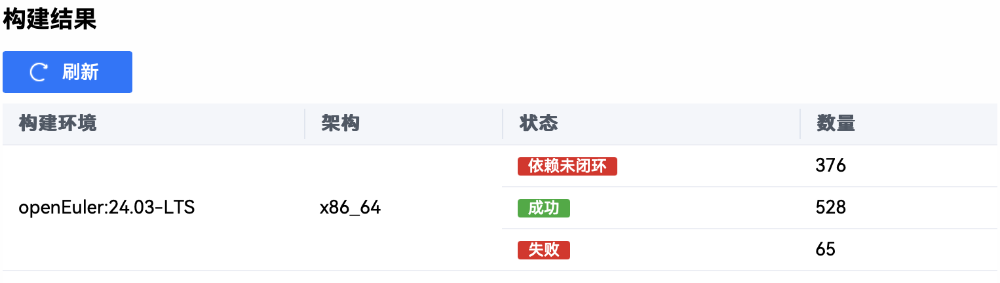

# 一月产出

## 乘风小队


### ros-jazzy 软件包构建

如下图**成功构建**：528



成功安装：

```
➜  ~ dnf list installed | grep ros-jazzy | wc -l
403
```

> 对比上月
> 新构建：184
> 成功安装：59

目前主要存在的问题是，很多包都是因为 eulermaker **无法访问** GitHub，需要手动去镜像仓库以及给对应的 CmakeLsist.txt 打 patch。
对于 turtlesim 而言因为 iceoryx 相关包无法访问 GitHub 而无法正确构建，下一步计划将这些 GitHub 无法访问解决就能启动 turtlesim。

目前核心包只有因为 **iceoryx** 没有构建成功进而导致 rcl 相关包无法构建，其他核心包如 ament 相关都构建成功。

```
1162
2025-01-25 12:14:28 -- Build files have been written to: /home/lkp/rpmbuild/BUILD/ros-jazzy-iceoryx-posh-2.0.6/.obj-x86_64-openEuler-linux-gnu/dependencies/cpptoml/download
1163
2025-01-25 12:14:28 [ 11%] Creating directories for 'ext_cpptoml'
1164
2025-01-25 12:14:28 [ 22%] Performing download step (git clone) for 'ext_cpptoml'
1165
2025-01-25 12:14:28 Cloning into 'src'...
1166
2025-01-25 12:16:38 fatal: unable to access 'https://github.com/skystrife/cpptoml.git/': Failed to connect to github.com port 443 after 129657 ms: Couldn't connect to server
1167
2025-01-25 12:16:38 Cloning into 'src'...
1168
2025-01-25 12:18:49 fatal: unable to access 'https://github.com/skystrife/cpptoml.git/': Failed to connect to github.com port 443 after 131056 ms: Couldn't connect to server
1169
2025-01-25 12:18:49 Cloning into 'src'...
1170
2025-01-25 12:21:00 fatal: unable to access 'https://github.com/skystrife/cpptoml.git/': Failed to connect to github.com port 443 after 131056 ms: Couldn't connect to server
1171
2025-01-25 12:21:00 -- Had to git clone more than once: 3 times.
1172
2025-01-25 12:21:00 CMake Error at download/ext_cpptoml-prefix/tmp/ext_cpptoml-gitclone.cmake:39 (message):
1173
2025-01-25 12:21:00 Failed to clone repository: 'https://github.com/skystrife/cpptoml.git'
1174
2025-01-25 12:21:00
1175
2025-01-25 12:21:00
1176
2025-01-25 12:21:00 gmake[2]: *** [CMakeFiles/ext_cpptoml.dir/build.make:99: ext_cpptoml-prefix/src/ext_cpptoml-stamp/ext_cpptoml-download] Error 1
1177
2025-01-25 12:21:00 gmake[1]: *** [CMakeFiles/Makefile2:83: CMakeFiles/ext_cpptoml.dir/all] Error 2
1178
2025-01-25 12:21:00 gmake: *** [Makefile:91: all] Error 2
1179
2025-01-25 12:21:00 CMake Error at cmake/cpptoml/CMakeLists.txt:55 (message):
1180
2025-01-25 12:21:00 Build step [download] for cpptoml failed: 2
1181
2025-01-25 12:21:00
1182
2025-01-25 12:21:00
1183
2025-01-25 12:21:00 -- Configuring incomplete, errors occurred!
1184
2025-01-25 12:21:00 error: Bad exit status from /var/tmp/rpm-tmp.4l9OSf (%build)
1185
2025-01-25 12:21:00 Bad exit status from /var/tmp/rpm-tmp.4l9OSf (%build)
1186
2025-01-25 12:21:00
1187
2025-01-25 12:21:00 RPM build errors:
1188
2025-01-25 12:21:00 failed to build rpms with ros-jazzy-iceoryx-posh.spec
```

### issue

在进行 ros-jazzy 软件包构建时发现两个**非 ros 包**相关的 issue：

- [GCC 未能生成或打包时省略了 include-fixed](https://github.com/Sebastianhayashi/openEuler-Jazzy-Porting/issues/2)
- [TBBConfig.cmake 缺失](https://github.com/Sebastianhayashi/openEuler-Jazzy-Porting/issues/3)

### 移植手册

该 ros 官方工具链（rospkg/rosdistro/rosdep/bloom）已经可以**成熟的**在 openeuler 上进行打包工作。

- [rospkg porting](https://github.com/Sebastianhayashi/openEuler-Jazzy-Porting/blob/main/toolchain_porting/01_rospkg_porting.md)
- [rosdistro and rosdep porting](https://github.com/Sebastianhayashi/openEuler-Jazzy-Porting/blob/main/toolchain_porting/02_rosdep_porting.md)

产出脚本：[auto_generate_openeuler_yaml.py](https://github.com/Sebastianhayashi/openEuler-Jazzy-Porting/blob/main/Scripts/%20auto_generate_openeuler_yaml.py)
feature：该脚本是用于**补充**官方（rosdistro/rosdep/base.yaml）的 base.yaml 文件中缺少的 openeuler 条目。
这个脚本的背景是当时在群里有跟韩老师聊过的内容：

使用说明：
依赖：PyYAML
请保证脚本当前目录存在 [base.yaml](https://github.com/Sebastianhayashi/rosdistro/blob/openeuler_init/rosdep/base.yaml)，然后直接执行该脚本就会输出 fail_list.txt 以及 base_openeuler.yaml。
将 base_openeuler.yaml 加入 rosdep 的源中即可正确识别。

### EUR 任务

产出一个自动化脚本，实现功能：

- 自动搜集 gitee 上用户的仓库做成 packages_info.json
- 自动读取本地 Copr 配置
- 从 packages_info.json 读取包信息，逐个提交到 EUR (Copr)

核心功能：将 gitee 上的仓库都上传到 EUR 中。

使用说明以及源码，请访问[这里](https://github.com/Sebastianhayashi/openEuler-Jazzy-Porting/tree/main/Scripts/EUR/batch_upload_ros)。

> 暂时还没有文字使用报告，目前只是能够实现**自动批量上传仓库**。


## Chatassembler 调研

产出内容：

- [文字版调研报告](https://github.com/Sebastianhayashi/Chata_Research/blob/main/README.md)
- [测试结果](https://github.com/Sebastianhayashi/Chata_Research/tree/main/csvs)
- [测试脚本](https://github.com/Sebastianhayashi/Chata_Research/tree/main/scripts)
- 技术分享

