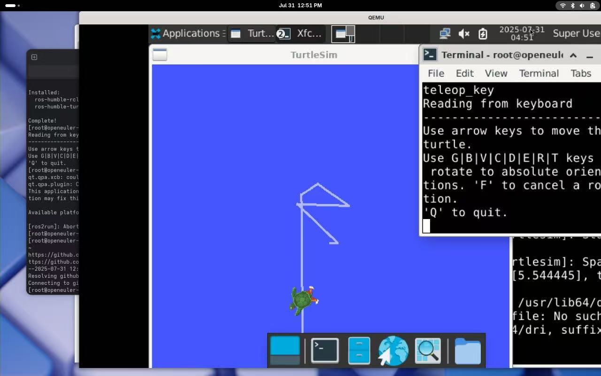

# 七月产出

## 乘风小队

### 大体产出说明

1. 关于依赖验证方案

本月自研了一个在没有 ROS 官方工具链支持的情况下快速验证 ROS 相关系统级依赖的方案及其脚本工具。
该方案目前已经成功验证了 openEuler ROS Humble Risc-V 的依赖以及 openKylin 2.0 SP1 的依赖情况。

得出如下结论：

- oerv 可以正常构建大部分的软件包 -> 着手构建
- openKylin 存在严重软件包无法安装以及缺包问题 -> 无法构建

2. oerv ROS Humble 构建

目前已经成功构建了 786  个 RV 包 -> [链接](https://build.tarsier-infra.isrc.ac.cn/project/show/home:Sebastianhayashi:ROS-Humble-openEuler)

3. openKylin 方向的调研工作

本月在李程老师的指导下解决了如下问题：

- 选用什么 openKylin 版本/架构进行 ROS 移植 -> [链接](https://github.com/Sebastianhayashi/ROS-Porting/issues/2)
- 移植 ROS 什么发行版 -> [链接](https://github.com/Sebastianhayashi/ROS-Porting/issues/2)
- 找到了阻碍移植的问题（缺包 + 大量软件包无法安装）-> [链接](https://github.com/Sebastianhayashi/ROS-Porting/blob/main/openKylin_Jazzy/results/README.md)

4. 成功启动 turtlesim 小乌龟




### 详细产出说明

```
ROS-Porting git:(main) ✗ tree
.
├── openEuler_humble
│   ├── all
│   │   ├── buildrequire_list.json -> 验证完成的依赖清单
│   │   └── README.md
│   ├── README.md -> humble 移植工作流文档（主要文档）
│   └── Scripts
│       ├── main
│       │   ├── extract_buildrequires.py -> oe SRPM 依赖提取器
│       │   └── verify_packages.py -> oe DNF 依赖验证器
│       └── tools -> 辅助工具
│           ├── import_srpms_single
│           │   ├── import_srpms_single.sh -> OBS srpm 批量上传工具
│           │   └── README.md
│           └── verify_srpm_on_lpi4a -> 在 lpi4a 上验证软件包正确性工具
│               ├── build_order.sh
│               ├── gen_build_order.py
│               └── rebuild_and_install.py
├── openKylin_Jazzy
│   ├── README.md
│   ├── results -> 工具输出结果
│   │   ├── apt_verify_search -> apt 验证（第二次）缺包结果
│   │   │   └── apt_search_report_20250728_164425.md
│   │   ├── extract_buildrequires -> 依赖提取结果
│   │   │   └── buildrequire_list_raw.json
│   │   ├── README.md
│   │   └── verify_packages -> 依赖第一次验证结果
│   │       └── buildrequire_list.json
│   ├── ros_core -> ros_core 变体范围内所需依赖
│   │   └── buildrequire_list_raw.json
│   └── scripts
│       ├── apt_verify_search.py -> apt 查找验证器
│       ├── extract_buildrequires.py -> ok 依赖提取
│       └── verify_packages.py -> ok 依赖验证
├── README.md
└── Verification_Scheme_for_System-Level_Dependency.md -> 方案文档（主要文档）

14 directories, 18 files
➜  ROS-Porting git:(main) ✗
➜  ~
```
本月解决的其他问题均放置在 [issue](https://github.com/Sebastianhayashi/ROS-Porting/issues) 中：

1. 解决了地基工程选择问题 -> [链接](https://github.com/Sebastianhayashi/ROS-Porting/issues/1)
2. openkylin 移植中沟通记录 -> [链接](https://github.com/Sebastianhayashi/ROS-Porting/issues/2)
3. 解决 OBS 中项目配置问题 -> [链接](https://github.com/Sebastianhayashi/ROS-Porting/issues/3)
4. [未解决]找到了一些包在 OBS 上非依赖原因无法编译的情况 -> [链接](https://github.com/Sebastianhayashi/ROS-Porting/issues/4)
5. 解决了一些包在并行上传的时候 broken 的问题 ->[链接](https://github.com/Sebastianhayashi/ROS-Porting/issues/5)
6. [未解决]开会上杨同学提及的 provide 问题 -> [链接](https://github.com/Sebastianhayashi/ROS-Porting/issues/6)
7. openkylin 缺包报告 -> [链接](https://github.com/Sebastianhayashi/ROS-Porting/issues/7)
8. [未解决]李程老师无法安装软件包清单需求- > [链接](https://github.com/Sebastianhayashi/ROS-Porting/issues/8)


### opencv issue

该 [issue](https://gitee.com/src-openeuler/opencv/issues/ICNZ2Q?from=project-issue) 是 openEuler 缺少 opencv-devel 子包问题及其解决方法建议。

### 其他说明

上月遗漏产出：
在 lpi4a 上实际 rebuild srpm 脚本：

```
├── openEuler_humble
│   ├── all
│   │   ├── buildrequire_list.json
│   │   └── README.md
│   ├── README.md
│   └── Scripts
│       ├── main
│       │   ├── extract_buildrequires.py
│       │   └── verify_packages.py
│       └── tools
│           ├── import_srpms_single
│           │   ├── import_srpms_single.sh
│           │   └── README.md
│           └── verify_srpm_on_lpi4a -> 上月遗漏产出脚本
│               ├── build_order.sh
│               ├── gen_build_order.py
│               └── rebuild_and_install.py
```


### 下个月计划

1. 开始着手打包 Jazzy 的 rv 包
2. 继续完善打包 Humble 的 jazzy 包
3. 继续与李程老师推进 openKylin 的 ROS 移植

## 郑老师方向

RuyiSDK matrix 建议 -> [issue](https://github.com/QA-Team-lo/support-matrix-frontend/issues/4)


