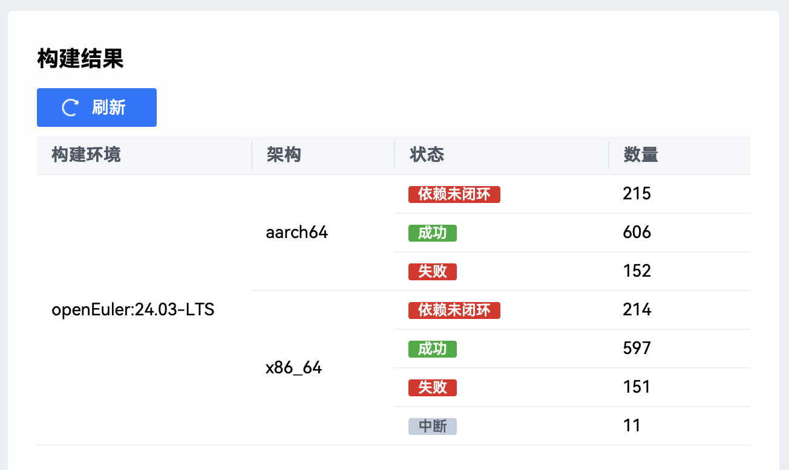
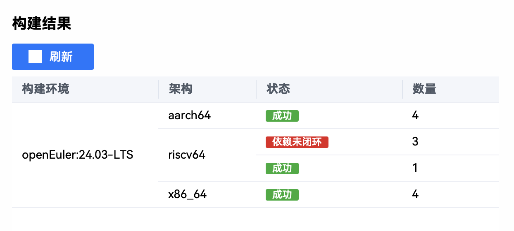
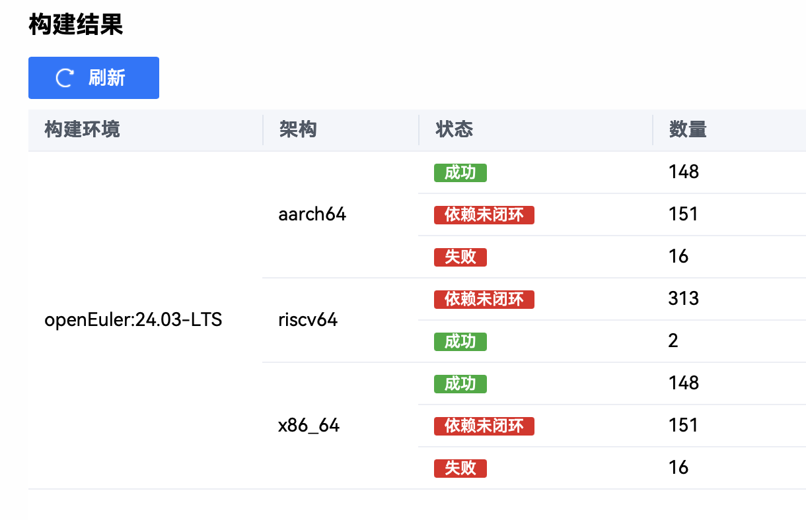

# 六月产出

## 综述

本月聚焦于调研 riscv64 软件包构建，其中遇到诸多问题如上游 srpm 中的 spec %ros_distro 宏展开问题。由于 riscv64 ros humble 软件包没有可以参考的软件源/地基工程原因，所以在寻找恰当的软件源/地基工程。

同时由于上游的 spec 以及 tarball 的集合方式有些混乱，比如说（https://gitee.com/src-openeuler/ament_cmake/tree/Multi-Version_ros-humble_openEuler-24.03-LTS/）其中的 ament_cmake 系列源码包和 spec 全部混杂在一个仓库下，且为了适配 eur 已经 define 好了 %ros_distro，会与我本地构建机器中定义重复等等的问题。

在实际构建中，还会遇到一些包出现不同的错误，如：ros-humble-octomap-1.9.8-2.oe2403.src.rpm 构建问题，详细日志见其他说明。

## aarch64 打包

eulermaker 构建工程：https://eulermaker.compass-ci.openeuler.openatom.cn/project/overview?osProject=jazzy_ament_package
成功构建 aarch64 ros jazzy 软件包 606 个：


目前由于从 qemu 启动 aarch64 openeuler 24.03 LTS 系统会随机出现“卡死”现象，导致无法顺利安装对应软件包，测试能不能运行 turtlesim（小乌龟）教程测试，下一步计划使用能够跑 vmware 的机器跑桌面版的 aarch64 openeuler 24.03 LTS 对这些新构建的软件包进行测试。


## riscv64 打包

### ros humble

目前 ros humble 上的问题是在于源码上混乱，上游 repo 中的 spec 与 srpm 中的代码不一致，考虑到上游的变动性大，所以选择 srpm 作为源码进行软件包构建。

在 lpi4a 上已经实现了软件包的构建并且能够部分正确安装，详细日志见其他说明


### ros jazzy

目前 eulermaker 已经确定可以根据我所生成的 spec 以及 tarball 进行软件包构建。
ros-jazzy-third-deps（前置依赖构建工程）：



desktop_ros_jazzy_1st(ros jazzy desktop 变体第一次构建尝试)：



但是目前的问题在于没有找到适合的地基工程或者软件源，于是目前打算直接在 lpi4a（riscv 开发版）使用对应的软件源去进行软件包构建正确性验证。

由于硬件资源有限，该计划打算在 ros humble riscv64 软件包构建结束后进行，或有进一步考虑能不能调用到更多的 riscv64 机器进行构建。

说明：为什么不直接使用 eulermaker 选择正确的地基工程/软件源去进行构建，因为 eulermaker 目前只能够构建但是不能够上传 riscv64 软件包构建的日志，即使能够构建也不能看到错误，无法 debug。该问题同样适用于 humble 与 jazzy。

## 其他说明

`ros-humble-octomap-1.9.8-2.oe2403.src.rpm` 软件包构建问题：
```
+ '[' '%{buildarch}' = noarch ']'
+ QA_CHECK_RPATHS=1
+ case "${QA_CHECK_RPATHS:-}" in
+ /usr/lib/rpm/check-rpaths
*******************************************************************************
*
* WARNING: 'check-rpaths' detected a broken RPATH OR RUNPATH and will cause
*          'rpmbuild' to fail. To ignore these errors, you can set the
*          '$QA_RPATHS' environment variable which is a bitmask allowing the
*          values below. The current value of QA_RPATHS is 0x0000.
*
*    0x0001 ... standard RPATHs (e.g. /usr/lib); such RPATHs are a minor
*               issue but are introducing redundant searchpaths without
*               providing a benefit. They can also cause errors in multilib
*               environments.
*    0x0002 ... invalid RPATHs; these are RPATHs which are neither absolute
*               nor relative filenames and can therefore be a SECURITY risk
*    0x0004 ... insecure RPATHs; these are relative RPATHs which are a
*               SECURITY risk
*    0x0008 ... the special '$ORIGIN' RPATHs are appearing after other
*               RPATHs; this is just a minor issue but usually unwanted
*    0x0010 ... the RPATH is empty; there is no reason for such RPATHs
*               and they cause unneeded work while loading libraries
*    0x0020 ... an RPATH references '..' of an absolute path; this will break
*               the functionality when the path before '..' is a symlink
*
*
* Examples:
* - to ignore standard and empty RPATHs, execute 'rpmbuild' like
*   $ QA_RPATHS=$(( 0x0001|0x0010 )) rpmbuild my-package.src.rpm
* - to check existing files, set $RPM_BUILD_ROOT and execute check-rpaths like
*   $ RPM_BUILD_ROOT=<top-dir> /usr/lib/rpm/check-rpaths
*
*******************************************************************************
ERROR   0002: file '/opt/ros/humble/bin/convert_octree' contains an invalid rpath '/opt/ros/humble/lib' in [/opt/ros/humble/lib]
ERROR   0002: file '/opt/ros/humble/bin/eval_octree_accuracy' contains an invalid rpath '/opt/ros/humble/lib' in [/opt/ros/humble/lib]
ERROR   0002: file '/opt/ros/humble/bin/bt2vrml' contains an invalid rpath '/opt/ros/humble/lib' in [/opt/ros/humble/lib]
ERROR   0002: file '/opt/ros/humble/bin/graph2tree' contains an invalid rpath '/opt/ros/humble/lib' in [/opt/ros/humble/lib]
ERROR   0002: file '/opt/ros/humble/lib/liboctomath.so.1.9.8' contains an invalid rpath '/opt/ros/humble/lib' in [/opt/ros/humble/lib]
*******************************************************************************
*
* WARNING: 'check-rpaths' detected a broken RPATH OR RUNPATH and will cause
*          'rpmbuild' to fail. To ignore these errors, you can set the
*          '$QA_RPATHS' environment variable which is a bitmask allowing the
*          values below. The current value of QA_RPATHS is 0x0000.
*
*    0x0001 ... standard RPATHs (e.g. /usr/lib); such RPATHs are a minor
*               issue but are introducing redundant searchpaths without
*               providing a benefit. They can also cause errors in multilib
*               environments.
*    0x0002 ... invalid RPATHs; these are RPATHs which are neither absolute
*               nor relative filenames and can therefore be a SECURITY risk
*    0x0004 ... insecure RPATHs; these are relative RPATHs which are a
*               SECURITY risk
*    0x0008 ... the special '$ORIGIN' RPATHs are appearing after other
*               RPATHs; this is just a minor issue but usually unwanted
*    0x0010 ... the RPATH is empty; there is no reason for such RPATHs
*               and they cause unneeded work while loading libraries
*    0x0020 ... an RPATH references '..' of an absolute path; this will break
*               the functionality when the path before '..' is a symlink
*
*
* Examples:
* - to ignore standard and empty RPATHs, execute 'rpmbuild' like
*   $ QA_RPATHS=$(( 0x0001|0x0010 )) rpmbuild my-package.src.rpm
* - to check existing files, set $RPM_BUILD_ROOT and execute check-rpaths like
*   $ RPM_BUILD_ROOT=<top-dir> /usr/lib/rpm/check-rpaths
*
*******************************************************************************
ERROR   0002: file '/opt/ros/humble/bin/compare_octrees' contains an invalid rpath '/opt/ros/humble/lib' in [/opt/ros/humble/lib]
ERROR   0002: file '/opt/ros/humble/lib/liboctomap.so.1.9.8' contains an invalid rpath '/opt/ros/humble/lib' in [/opt/ros/humble/lib]
ERROR   0002: file '/opt/ros/humble/bin/binvox2bt' contains an invalid rpath '/opt/ros/humble/lib' in [/opt/ros/humble/lib]
ERROR   0002: file '/opt/ros/humble/bin/edit_octree' contains an invalid rpath '/opt/ros/humble/lib' in [/opt/ros/humble/lib]
ERROR   0002: file '/opt/ros/humble/bin/log2graph' contains an invalid rpath '/opt/ros/humble/lib' in [/opt/ros/humble/lib]
error: Bad exit status from /var/tmp/rpm-tmp.XgWHDX (%install)

RPM build errors:
    Bad exit status from /var/tmp/rpm-tmp.XgWHDX (%install)
```

目前能够在 lpi4a 上成功构建的 riscv64 软件包：
```
[openeuler@openeuler-riscv64 riscv64]$ tree
.
├── ros-humble-ament-acceleration-0.2.0-1.riscv64.rpm
├── ros-humble-ament-cmake-catch2-1.2.0-1.riscv64.rpm
├── ros-humble-ament-cmake-core-1.3.4-1.riscv64.rpm
├── ros-humble-ament-cmake-export-definitions-1.3.4-1.riscv64.rpm
├── ros-humble-ament-cmake-export-dependencies-1.3.4-1.riscv64.rpm
├── ros-humble-ament-cmake-export-include-directories-1.3.4-1.riscv64.rpm
├── ros-humble-ament-cmake-export-interfaces-1.3.4-1.riscv64.rpm
├── ros-humble-ament-cmake-export-libraries-1.3.4-1.riscv64.rpm
├── ros-humble-ament-cmake-export-link-flags-1.3.4-1.riscv64.rpm
├── ros-humble-ament-cmake-export-targets-1.3.4-1.riscv64.rpm
├── ros-humble-ament-cmake-gmock-1.3.4-1.riscv64.rpm
├── ros-humble-ament-cmake-gtest-1.3.4-1.riscv64.rpm
├── ros-humble-ament-cmake-include-directories-1.3.4-1.riscv64.rpm
├── ros-humble-ament-cmake-libraries-1.3.4-1.riscv64.rpm
├── ros-humble-ament-cmake-nose-1.3.4-1.riscv64.rpm
├── ros-humble-ament-cmake-pytest-1.3.4-1.riscv64.rpm
├── ros-humble-ament-cmake-python-1.3.4-1.riscv64.rpm
├── ros-humble-ament-cmake-target-dependencies-1.3.4-1.riscv64.rpm
├── ros-humble-ament-cmake-version-1.3.4-1.riscv64.rpm
├── ros-humble-ament-cppcheck-0.12.6-1.riscv64.rpm
├── ros-humble-ament-flake8-0.12.6-1.riscv64.rpm
├── ros-humble-ament-lint-0.12.6-1.riscv64.rpm
├── ros-humble-ament-package-0.14.0-1.riscv64.rpm
├── ros-humble-ament-pycodestyle-0.12.6-1.riscv64.rpm
├── ros-humble-fastcdr-1.0.24-1.riscv64.rpm
├── ros-humble-fastcdr-debuginfo-1.0.24-1.riscv64.rpm
├── ros-humble-fastcdr-debugsource-1.0.24-1.riscv64.rpm
├── ros-humble-gmock-vendor-1.10.9004-1.riscv64.rpm
├── ros-humble-google-benchmark-vendor-0.1.1-1.riscv64.rpm
├── ros-humble-grid-map-cmake-helpers-2.0.0-1.riscv64.rpm
├── ros-humble-gtest-vendor-1.10.9004-1.riscv64.rpm
├── ros-humble-joint-state-publisher-gui-2.3.0-1.riscv64.rpm
├── ros-humble-magic-enum-0.8.2-2.riscv64.rpm
├── ros-humble-osrf-pycommon-2.0.2-1.riscv64.rpm
├── ros-humble-osrf-testing-tools-cpp-1.5.2-1.riscv64.rpm
├── ros-humble-osrf-testing-tools-cpp-debuginfo-1.5.2-1.riscv64.rpm
├── ros-humble-osrf-testing-tools-cpp-debugsource-1.5.2-1.riscv64.rpm
├── ros-humble-py-trees-2.2.3-1.riscv64.rpm
├── ros-humble-rcdiscover-1.1.6-1.riscv64.rpm
├── ros-humble-rmf-traffic-editor-assets-1.6.0-1.riscv64.rpm
├── ros-humble-rosbridge-suite-1.3.1-1.riscv64.rpm
├── ros-humble-ros-environment-3.2.2-1.riscv64.rpm
├── ros-humble-ros-workspace-1.0.2-1.riscv64.rpm
├── ros-humble-rqt-1.1.5-1.riscv64.rpm
├── ros-humble-rqt-action-2.0.1-1.riscv64.rpm
├── ros-humble-rqt-bag-1.1.4-1.riscv64.rpm
├── ros-humble-rqt-bag-plugins-1.1.4-1.riscv64.rpm
├── ros-humble-rqt-console-2.0.2-1.riscv64.rpm
├── ros-humble-rqt-controller-manager-2.25.2-1.riscv64.rpm
├── ros-humble-rqt-joint-trajectory-controller-2.17.3-1.riscv64.rpm
├── ros-humble-rqt-msg-1.2.0-1.riscv64.rpm
├── ros-humble-rqt-plot-1.1.2-1.riscv64.rpm
├── ros-humble-rqt-publisher-1.5.0-1.riscv64.rpm
├── ros-humble-rqt-py-console-1.0.2-1.riscv64.rpm
├── ros-humble-rqt-service-caller-1.0.5-1.riscv64.rpm
├── ros-humble-rqt-shell-1.0.2-1.riscv64.rpm
├── ros-humble-rqt-srv-1.0.3-1.riscv64.rpm
├── ros-humble-ruckig-0.9.2-1.riscv64.rpm
├── ros-humble-ruckig-debuginfo-0.9.2-1.riscv64.rpm
├── ros-humble-ruckig-debugsource-0.9.2-1.riscv64.rpm
├── ros-humble-sdformat-test-files-1.0.1-1.riscv64.rpm
├── ros-humble-test-interface-files-0.9.1-1.riscv64.rpm
├── ros-humble-tf2-tools-0.25.2-1.riscv64.rpm
├── ros-humble-turtlebot3-teleop-2.1.5-1.riscv64.rpm
├── ros-humble-ur-client-library-1.3.1-1.riscv64.rpm
├── ros-humble-ur-client-library-debuginfo-1.3.1-1.riscv64.rpm
├── ros-humble-ur-client-library-debugsource-1.3.1-1.riscv64.rpm
├── ros-humble-urdfdom-headers-1.0.6-1.riscv64.rpm
├── ros-humble-urdfdom-py-1.2.0-1.riscv64.rpm
├── ros-humble-vrpn-7.35.0-1.riscv64.rpm
├── ros-humble-vrpn-debuginfo-7.35.0-1.riscv64.rpm
└── ros-humble-vrpn-debugsource-7.35.0-1.riscv64.rpm

1 directory, 72 files
[openeuler@openeuler-riscv64 riscv64]$
```

已经成功构建 72 个软件包，其中 46 个软件包能够正确的安装：

```
ros-humble-examples-rclpy-executors-0.15.1-1.oe2403.src.rpm
ros-humble-examples-rclpy-guard-conditions-0.15.1-1.oe2403.src.rpm
ros-humble-examples-rclpy-minimal-action-client-0.15.1-1.oe2403.src.rpm
ros-humble-examples-rclpy-minimal-action-server-0.15.1-1.oe2403.src.rpm
ros-humble-examples-rclpy-minimal-client-0.15.1-1.oe2403.src.rpm
ros-humble-examples-rclpy-minimal-publisher-0.15.1-1.oe2403.src.rpm
ros-humble-examples-rclpy-minimal-service-0.15.1-1.oe2403.src.rpm
ros-humble-examples-rclpy-minimal-subscriber-0.15.1-1.oe2403.src.rpm
ros-humble-examples-rclpy-pointcloud-publisher-0.15.1-1.oe2403.src.rpm
ros-humble-examples-tf2-py-0.25.2-1.oe2403.src.rpm
ros-humble-fastrtps-2.6.4-1.oe2403.src.rpm
ros-humble-fastrtps-cmake-module-2.2.0-1.oe2403.src.rpm
ros-humble-filters-2.1.0-1.oe2403.src.rpm
ros-humble-find-object-2d-0.7.0-1.oe2403.src.rpm
ros-humble-fluent-rviz-0.0.3-1.oe2403.src.rpm
ros-humble-foonathan-memory-vendor-1.2.0-1.oe2403.src.rpm
ros-humble-foros-0.4.1-1.oe2403.src.rpm
ros-humble-foros-examples-0.4.1-1.oe2403.src.rpm
ros-humble-foros-inspector-0.4.1-1.oe2403.src.rpm
ros-humble-foros-msgs-0.4.1-1.oe2403.src.rpm
ros-humble-four-wheel-steering-msgs-2.0.1-1.oe2403.src.rpm
ros-humble-foxglove-msgs-2.2.0-1.oe2403.src.rpm
ros-humble-gazebo-msgs-3.7.0-1.oe2403.src.rpm
ros-humble-gazebo-ros-pkgs-3.7.0-1.oe2403.src.rpm
ros-humble-gc-spl-2022-2.0.0-1.oe2403.src.rpm
ros-humble-generate-parameter-library-0.3.3-1.oe2403.src.rpm
ros-humble-generate-parameter-library-example-0.3.3-1.oe2403.src.rpm
ros-humble-generate-parameter-library-py-0.3.3-1.oe2403.src.rpm
ros-humble-geographic-msgs-1.0.5-1.oe2403.src.rpm
ros-humble-geometric-shapes-2.1.3-1.oe2403.src.rpm
ros-humble-geometry2-0.25.2-1.oe2403.src.rpm
ros-humble-geometry-msgs-4.2.3-1.oe2403.src.rpm
ros-humble-geometry-tutorials-0.3.6-1.oe2403.src.rpm
ros-humble-gpsd-client-2.0.0-1.oe2403.src.rpm
ros-humble-gps-msgs-2.0.0-1.oe2403.src.rpm
ros-humble-gps-tools-2.0.0-1.oe2403.src.rpm
ros-humble-gps-umd-2.0.0-1.oe2403.src.rpm
ros-humble-graph-msgs-0.2.0-1.oe2403.src.rpm
ros-humble-grasping-msgs-0.4.0-1.oe2403.src.rpm
ros-humble-grbl-msgs-0.0.2-1.oe2403.src.rpm
ros-humble-grid-map-2.0.0-1.oe2403.src.rpm
ros-humble-grid-map-core-2.0.0-1.oe2403.src.rpm
ros-humble-grid-map-costmap-2d-2.0.0-1.oe2403.src.rpm
ros-humble-grid-map-cv-2.0.0-1.oe2403.src.rpm
ros-humble-grid-map-demos-2.0.0-1.oe2403.src.rpm

ros-humble-image-proc-3.0.0-1.oe2403.src.rpm
ros-humble-image-publisher-3.0.0-1.oe2403.src.rpm
ros-humble-image-rotate-3.0.0-1.oe2403.src.rpm
ros-humble-image-tools-0.20.3-1.oe2403.src.rpm
ros-humble-image-transport-3.1.5-1.oe2403.src.rpm
ros-humble-image-transport-plugins-2.5.0-1.oe2403.src.rpm
ros-humble-image-view-3.0.0-1.oe2403.src.rpm
ros-humble-imu-complementary-filter-2.1.3-1.oe2403.src.rpm
ros-humble-imu-filter-madgwick-2.1.3-1.oe2403.src.rpm
ros-humble-imu-tools-2.1.3-1.oe2403.src.rpm
ros-humble-interactive-markers-2.3.2-1.oe2403.src.rpm
ros-humble-intra-process-demo-0.20.3-1.oe2403.src.rpm
ros-humble-io-context-1.2.0-1.oe2403.src.rpm
ros-humble-irobot-create-common-bringup-2.0.0-1.oe2403.src.rpm
ros-humble-irobot-create-control-2.0.0-1.oe2403.src.rpm
ros-humble-irobot-create-description-2.0.0-1.oe2403.src.rpm
ros-humble-irobot-create-gazebo-sim-2.0.0-1.oe2403.src.rpm
ros-humble-irobot-create-ignition-bringup-2.0.0-1.oe2403.src.rpm
ros-humble-irobot-create-ignition-sim-2.0.0-1.oe2403.src.rpm
ros-humble-irobot-create-toolbox-2.0.0-1.oe2403.src.rpm
ros-humble-joint-limits-2.25.2-1.oe2403.src.rpm
ros-humble-joint-state-publisher-2.3.0-1.oe2403.src.rpm
ros-humble-joy-3.1.0-1.oe2403.src.rpm
ros-humble-joy-linux-3.1.0-1.oe2403.src.rpm
ros-humble-joy-teleop-1.3.0-1.oe2403.src.rpm
ros-humble-kdl-parser-2.6.4-1.oe2403.src.rpm
ros-humble-keyboard-handler-0.0.5-1.oe2403.src.rpm
ros-humble-key-teleop-1.3.0-1.oe2403.src.rpm
ros-humble-kinematics-interface-0.1.0-1.oe2403.src.rpm
ros-humble-kinematics-interface-kdl-0.1.0-1.oe2403.src.rpm
ros-humble-kobuki-ros-interfaces-1.0.0-1.oe2403.src.rpm
ros-humble-kobuki-velocity-smoother-0.15.0-1.oe2403.src.rpm
ros-humble-laser-filters-2.0.6-1.oe2403.src.rpm
ros-humble-laser-geometry-2.4.0-1.oe2403.src.rpm
ros-humble-laser-proc-1.0.2-1.oe2403.src.rpm
ros-humble-launch-1.0.4-1.oe2403.src.rpm
ros-humble-launch-pal-0.0.7-1.oe2403.src.rpm
ros-humble-launch-param-builder-0.1.1-1.oe2403.src.rpm
ros-humble-launch-pytest-1.0.4-1.oe2403.src.rpm
ros-humble-launch-ros-0.19.4-1.oe2403.src.rpm
ros-humble-launch-system-modes-0.9.0-1.oe2403.src.rpm
ros-humble-launch-testing-1.0.4-1.oe2403.src.rpm
ros-humble-launch-testing-ament-cmake-1.0.4-1.oe2403.src.rpm
ros-humble-launch-testing-ros-0.19.4
ros-humble-lusb-2.0.1-1.oe2403.src.rpm
ros-humble-map-msgs-2.1.0-1.oe2403.src.rpm
ros-humble-mapviz-interfaces-2.2.0-1.oe2403.src.rpm
ros-humble-marti-can-msgs-1.4.0-1.oe2403.src.rpm
ros-humble-marti-common-msgs-1.4.0-1.oe2403.src.rpm
ros-humble-marti-dbw-msgs-1.4.0-1.oe2403.src.rpm
ros-humble-marti-introspection-msgs-1.4.0-1.oe2403.src.rpm
ros-humble-marti-nav-msgs-1.4.0-1.oe2403.src.rpm
ros-humble-marti-perception-msgs-1.4.0-1.oe2403.src.rpm
ros-humble-marti-sensor-msgs-1.4.0-1.oe2403.src.rpm
ros-humble-marti-status-msgs-1.4.0-1.oe2403.src.rpm
ros-humble-marti-visualization-msgs-1.4.0-1.oe2403.src.rpm
ros-humble-mavlink-2022.12.30-1.oe2403.src.rpm
ros-humble-mavros-msgs-2.4.0-1.oe2403.src.rpm
ros-humble-mcap-vendor-0.15.5-1.oe2403.src.rpm
ros-humble-message-filters-4.3.3-1.oe2403.src.rpm
ros-humble-micro-ros-diagnostic-bridge-0.3.0-1.oe2403.src.rpm
ros-humble-micro-ros-diagnostic-msgs-0.3.0-1.oe2403.src.rpm
ros-humble-micro-ros-msgs-1.0.0-1.oe2403.src.rpm
ros-humble-microstrain-inertial-driver-3.0.1-2.oe2403.src.rpm
ros-humble-microstrain-inertial-examples-3.0.1-1.oe2403.src.rpm
ros-humble-microstrain-inertial-msgs-3.0.1-1.oe2403.src.rpm
ros-humble-mimick-vendor-0.2.8-1.oe2403.src.rpm
ros-humble-mod-1.1.0-1.oe2403.src.rpm
ros-humble-mouse-teleop-1.3.0-1.oe2403.src.rpm
ros-humble-moveit-2.5.4-1.oe2403.src.rpm
ros-humble-moveit-chomp-optimizer-adapter-2.5.4-1.oe2403.src.rpm
ros-humble-moveit-common-2.5.4-1.oe2403.src.rpm
ros-humble-moveit-configs-utils-2.5.4-1.oe2403.src.rpm
ros-humble-moveit-core-2.5.4-1.oe2403.src.rpm
ros-humble-moveit-hybrid-planning-2.5.4-1.oe2403.src.rpm
ros-humble-moveit-kinematics-2.5.4-1.oe2403.src.rpm
ros-humble-moveit-msgs-2.2.1-1.oe2403.src.rpm
ros-humble-moveit-planners-2.5.4-1.oe2403.src.rpm
ros-humble-moveit-planners-chomp-2.5.4-1.oe2403.src.rpm
ros-humble-moveit-planners-ompl-2.5.4-1.oe2403.src.rpm
ros-humble-moveit-plugins-2.5.4-1.oe2403.src.rpm
ros-humble-moveit-resources-2.0.6-1.oe2403.src.rpm
ros-humble-moveit-resources-fanuc-description-2.0.6-1.oe2403.src.rpm
ros-humble-moveit-resources-fanuc-moveit-config-2.0.6-1.oe2403.src.rpm
ros-humble-moveit-resources-panda-description-2.0.6-1.oe2403.src.rpm
ros-humble-moveit-resources-panda-moveit-config-2.0.6-1.oe2403.src.rpm
ros-humble-moveit-resources-pr2-description-2.0.6-1.oe2403.src.rpm

ros-humble-moveit-setup-assistant-2.5.4-1.oe2403.src.rpm
ros-humble-moveit-setup-controllers-2.5.4-1.oe2403.src.rpm
ros-humble-moveit-setup-core-plugins-2.5.4-1.oe2403.src.rpm
ros-humble-moveit-setup-framework-2.5.4-1.oe2403.src.rpm
ros-humble-moveit-setup-srdf-plugins-2.5.4-1.oe2403.src.rpm
ros-humble-moveit-simple-controller-manager-2.5.4-1.oe2403.src.rpm
ros-humble-moveit-visual-tools-4.1.0-1.oe2403.src.rpm
ros-humble-mrpt-msgs-0.4.4-1.oe2403.src.rpm
ros-humble-nao-button-sim-0.1.1-1.oe2403.src.rpm
ros-humble-nao-command-msgs-0.0.4-1.oe2403.src.rpm
ros-humble-nao-lola-0.1.0-1.oe2403.src.rpm
ros-humble-nao-sensor-msgs-0.0.4-1.oe2403.src.rpm
ros-humble-nav2-amcl-1.1.9-1.oe2403.src.rpm
ros-humble-nav2-behaviors-1.1.9-1.oe2403.src.rpm
ros-humble-nav2-behavior-tree-1.1.9-1.oe2403.src.rpm
ros-humble-nav2-bt-navigator-1.1.9-1.oe2403.src.rpm
ros-humble-nav2-collision-monitor-1.1.9-1.oe2403.src.rpm
ros-humble-nav2-common-1.1.9-1.oe2403.src.rpm
ros-humble-nav2-constrained-smoother-1.1.9-1.oe2403.src.rpm
ros-humble-nav2-controller-1.1.9-1.oe2403.src.rpm
ros-humble-nav2-core-1.1.9-1.oe2403.src.rpm
ros-humble-nav2-costmap-2d-1.1.9-1.oe2403.src.rpm
ros-humble-nav-2d-msgs-1.1.9-1.oe2403.src.rpm
ros-humble-nav-2d-utils-1.1.9-1.oe2403.src.rpm
ros-humble-nav2-dwb-controller-1.1.9-1.oe2403.src.rpm
ros-humble-nav2-lifecycle-manager-1.1.9-1.oe2403.src.rpm
ros-humble-nav2-map-server-1.1.9-1.oe2403.src.rpm
ros-humble-nav2-msgs-1.1.9-1.oe2403.src.rpm
ros-humble-nav2-navfn-planner-1.1.9-1.oe2403.src.rpm
ros-humble-nav2-planner-1.1.9-1.oe2403.src.rpm
ros-humble-nav2-regulated-pure-pursuit-controller-1.1.9-1.oe2403.src.rpm
ros-humble-nav2-rotation-shim-controller-1.1.9-1.oe2403.src.rpm
ros-humble-nav2-rviz-plugins-1.1.9-1.oe2403.src.rpm
ros-humble-nav2-simple-commander-1.1.9-1.oe2403.src.rpm
ros-humble-nav2-smac-planner-1.1.9-1.oe2403.src.rpm
ros-humble-nav2-smoother-1.1.9-1.oe2403.src.rpm
ros-humble-nav2-theta-star-planner-1.1.9-1.oe2403.src.rpm
ros-humble-nav2-util-1.1.9-1.oe2403.src.rpm
ros-humble-nav2-velocity-smoother-1.1.9-1.oe2403.src.rpm
ros-humble-nav2-voxel-grid-1.1.9-1.oe2403.src.rpm
ros-humble-nav2-waypoint-follower-1.1.9-1.oe2403.src.rpm
ros-humble-navigation2-1.1.9-1.oe2403.src.rpm
ros-humble-nav-msgs-4.2.3-1.oe2403.src.rpm
ros-humble-neo-simulation2-1.0.0-1.oe2403.src.rpm
ros-humble-nerian-stereo-1.2.0-1.oe2403.src.rpm
ros-humble-nmea-msgs-2.0.0-1.oe2403.src.rpm
ros-humble-nodl-python-0.3.1-1.oe2403.src.rpm
ros-humble-novatel-gps-msgs-4.1.1-1.oe2403.src.rpm
ros-humble-ntrip-client-1.2.0-1.oe2403.src.rpm
ros-humble-object-recognition-msgs-2.0.0-1.oe2403.src.rpm
ros-humble-octomap-1.9.8-2.oe2403.src.rpm
ros-humble-octomap-mapping-2.0.0-1.oe2403.src.rpm
ros-humble-octomap-msgs-2.0.0-1.oe2403.src.rpm
ros-humble-octomap-ros-0.4.3-1.oe2403.src.rpm
ros-humble-octomap-rviz-plugins-2.0.0-1.oe2403.src.rpm
ros-humble-octomap-server-2.0.0-1.oe2403.src.rpm
ros-humble-octovis-1.9.8-1.oe2403.src.rpm
ros-humble-ompl-1.6.0-1.oe2403.src.rpm
ros-humble-orocos-kdl-vendor-0.2.5-1.oe2403.src.rpm
ros-humble-ouster-msgs-0.4.2-1.oe2403.src.rpm
ros-humble-ouxt-common-0.0.8-1.oe2403.src.rpm
ros-humble-ouxt-lint-common-0.0.8-1.oe2403.src.rpm
ros-humble-pal-gazebo-worlds-3.0.3-1.oe2403.src.rpm
ros-humble-pal-gripper-3.0.4-1.oe2403.src.rpm
ros-humble-pal-gripper-controller-configuration-3.0.4-1.oe2403.src.rpm
ros-humble-pal-gripper-description-3.0.4-1.oe2403.src.rpm
ros-humble-pal-statistics-2.1.5-2.oe2403.src.rpm
ros-humble-pal-statistics-msgs-2.1.5-1.oe2403.src.rpm
ros-humble-parameter-traits-0.3.3-1.oe2403.src.rpm
ros-humble-pcl-conversions-2.4.0-1.oe2403.src.rpm
ros-humble-pcl-msgs-1.0.0-1.oe2403.src.rpm
ros-humble-pcl-ros-2.4.0-1.oe2403.src.rpm
ros-humble-pendulum-msgs-0.20.3-1.oe2403.src.rpm
ros-humble-perception-0.10.0-1.oe2403.src.rpm
ros-humble-perception-pcl-2.4.0-1.oe2403.src.rpm
ros-humble-performance-test-fixture-0.0.9-1.oe2403.src.rpm
ros-humble-phidgets-accelerometer-2.3.1-1.oe2403.src.rpm
ros-humble-phidgets-analog-inputs-2.3.1-1.oe2403.src.rpm
ros-humble-phidgets-api-2.3.1-1.oe2403.src.rpm
ros-humble-phidgets-digital-inputs-2.3.1-1.oe2403.src.rpm
ros-humble-phidgets-digital-outputs-2.3.1-1.oe2403.src.rpm
ros-humble-phidgets-drivers-2.3.1-1.oe2403.src.rpm
ros-humble-phidgets-gyroscope-2.3.1-1.oe2403.src.rpm
ros-humble-phidgets-high-speed-encoder-2.3.1-1.oe2403.src.rpm
ros-humble-phidgets-ik-2.3.1-1.oe2403.src.rpm
ros-humble-phidgets-magnetometer-2.3.1-1.oe2403.src.rpm
ros-humble-phidgets-motors-2.3.1-1.oe2403.src.rpm
ros-humble-phidgets-msgs-2.3.1-1.oe2403.src.rpm
ros-humble-phidgets-spatial-2.3.1-1.oe2403.src.rpm
ros-humble-phidgets-temperature-2.3.1-1.oe2403.src.rpm
ros-humble-pick-ik-1.0.1-1.oe2403.src.rpm
ros-humble-pilz-industrial-motion-planner-2.5.4-1.oe2403.src.rpm
ros-humble-pilz-industrial-motion-planner-testutils-2.5.4-1.oe2403.src.rpm
ros-humble-plansys2-core-2.0.9-1.oe2403.src.rpm
ros-humble-plansys2-lifecycle-manager-2.0.9-1.oe2403.src.rpm
ros-humble-plansys2-msgs-2.0.9-1.oe2403.src.rpm
ros-humble-plansys2-pddl-parser-2.0.9-1.oe2403.src.rpm
ros-humble-plotjuggler-msgs-0.2.3-1.oe2403.src.rpm
ros-humble-pluginlib-5.1.0-1.oe2403.src.rpm
ros-humble-pmb2-2dnav-4.0.3-1.oe2403.src.rpm
ros-humble-pmb2-bringup-5.0.3-1.oe2403.src.rpm
ros-humble-pmb2-controller-configuration-5.0.3-1.oe2403.src.rpm
ros-humble-pmb2-description-5.0.3-1.oe2403.src.rpm
ros-humble-pmb2-maps-4.0.3-1.oe2403.src.rpm
ros-humble-pmb2-navigation-4.0.3-1.oe2403.src.rpm
ros-humble-pmb2-robot-5.0.3-1.oe2403.src.rpm
ros-humble-point-cloud-msg-wrapper-1.0.7-1.oe2403.src.rpm
ros-humble-pointcloud-to-laserscan-2.0.1-1.oe2403.src.rpm
ros-humble-pybind11-vendor-2.4.2-1.oe2403.src.rpm
ros-humble-python-cmake-module-0.10.0-1.oe2403.src.rpm
ros-humble-python-orocos-kdl-vendor-0.2.5-1.oe2403.src.rpm
ros-humble-python-qt-binding-1.1.1-1.oe2403.src.rpm
ros-humble-py-trees-ros-2.2.2-1.oe2403.src.rpm
ros-humble-py-trees-ros-interfaces-2.1.0-1.oe2403.src.rpm
ros-humble-qpoases-vendor-3.2.3-1.oe2403.src.rpm
ros-humble-qt-dotgraph-2.2.2-1.oe2403.src.rpm
ros-humble-qt-gui-2.2.2-1.oe2403.src.rpm
ros-humble-qt-gui-app-2.2.2-1.oe2403.src.rpm
ros-humble-qt-gui-core-2.2.2-1.oe2403.src.rpm
ros-humble-qt-gui-cpp-2.2.2-1.oe2403.src.rpm
ros-humble-qt-gui-py-common-2.2.2-1.oe2403.src.rpm
ros-humble-quality-of-service-demo-cpp-0.20.3-1.oe2403.src.rpm
ros-humble-quality-of-service-demo-py-0.20.3-1.oe2403.src.rpm
ros-humble-r2r-spl-7-2.0.1-1.oe2403.src.rpm
ros-humble-radar-msgs-0.2.1-1.oe2403.src.rpm
ros-humble-random-numbers-2.0.1-1.oe2403.src.rpm
ros-humble-raspimouse-1.1.1-1.oe2403.src.rpm
ros-humble-raspimouse-msgs-1.1.1-1.oe2403.src.rpm
ros-humble-rc-common-msgs-0.5.3-1.oe2403.src.rpm
ros-humble-rcgcd-spl-14-2.0.0-1.oe2403.src.rpm
ros-humble-rcgcd-spl-14-conversion-2.0.0-1.oe2403.src.rpm
ros-humble-rcgcrd-spl-4-2.0.0-1.oe2403.src.rpm
ros-humble-rcgcrd-spl-4-conversion-2.0.0-1.oe2403.src.rpm
ros-humble-rcl-5.3.3-1.oe2403.src.rpm
ros-humble-rcl-action-5.3.3-1.oe2403.src.rpm
ros-humble-rclc-4.0.2-1.oe2403.src.rpm
ros-humble-rclc-examples-4.0.2-1.oe2403.src.rpm
ros-humble-rclc-lifecycle-4.0.2-1.oe2403.src.rpm
ros-humble-rclc-parameter-4.0.2-1.oe2403.src.rpm
ros-humble-rclcpp-16.0.4-1.oe2403.src.rpm
ros-humble-rclcpp-action-16.0.4-1.oe2403.src.rpm
ros-humble-rclcpp-cascade-lifecycle-1.0.2-1.oe2403.src.rpm
ros-humble-rclcpp-components-16.0.4-1.oe2403.src.rpm
ros-humble-rclcpp-lifecycle-16.0.4-1.oe2403.src.rpm
ros-humble-rcl-interfaces-1.2.1-1.oe2403.src.rpm
ros-humble-rcl-lifecycle-5.3.3-1.oe2403.src.rpm
ros-humble-rcl-logging-interface-2.3.1-1.oe2403.src.rpm
ros-humble-rcl-logging-noop-2.3.1-1.oe2403.src.rpm

ros-humble-rmf-building-map-tools-1.6.0-1.oe2403.src.rpm
ros-humble-rmf-charger-msgs-3.0.2-1.oe2403.src.rpm
ros-humble-rmf-cmake-uncrustify-1.2.0-1.oe2403.src.rpm
ros-humble-rmf-dispenser-msgs-3.0.2-1.oe2403.src.rpm
ros-humble-rmf-door-msgs-3.0.2-1.oe2403.src.rpm
ros-humble-rmf-fleet-msgs-3.0.2-1.oe2403.src.rpm
ros-humble-rmf-ingestor-msgs-3.0.2-1.oe2403.src.rpm
ros-humble-rmf-lift-msgs-3.0.2-1.oe2403.src.rpm
ros-humble-rmf-obstacle-msgs-3.0.2-1.oe2403.src.rpm
ros-humble-rmf-robot-sim-common-2.0.0-1.oe2403.src.rpm
ros-humble-rmf-scheduler-msgs-3.0.2-1.oe2403.src.rpm
ros-humble-rmf-site-map-msgs-3.0.2-1.oe2403.src.rpm
ros-humble-rmf-task-2.1.1-1.oe2403.src.rpm
ros-humble-rmf-task-msgs-3.0.2-1.oe2403.src.rpm
ros-humble-rmf-traffic-3.0.0-1.oe2403.src.rpm
ros-humble-rmf-traffic-examples-3.0.0-1.oe2403.src.rpm
ros-humble-rmf-traffic-msgs-3.0.2-1.oe2403.src.rpm
ros-humble-rmf-utils-1.4.0-1.oe2403.src.rpm
ros-humble-rmf-visualization-2.0.0-1.oe2403.src.rpm
ros-humble-rmf-visualization-building-systems-2.0.0-1.oe2403.src.rpm
ros-humble-rmf-visualization-fleet-states-2.0.0-1.oe2403.src.rpm
ros-humble-rmf-visualization-floorplans-2.0.0-1.oe2403.src.rpm
ros-humble-rmf-visualization-msgs-1.2.0-1.oe2403.src.rpm
ros-humble-rmf-visualization-obstacles-2.0.0-1.oe2403.src.rpm
ros-humble-rmf-workcell-msgs-3.0.2-1.oe2403.src.rpm
ros-humble-rmw-6.1.1-1.oe2403.src.rpm
ros-humble-rmw-cyclonedds-cpp-1.3.4-1.oe2403.src.rpm
ros-humble-rmw-dds-common-1.6.0-1.oe2403.src.rpm
ros-humble-rmw-fastrtps-cpp-6.2.2-1.oe2403.src.rpm
ros-humble-rmw-fastrtps-dynamic-cpp-6.2.2-1.oe2403.src.rpm
ros-humble-rmw-fastrtps-shared-cpp-6.2.2-1.oe2403.src.rpm
ros-humble-rmw-implementation-2.8.2-1.oe2403.src.rpm
ros-humble-rmw-implementation-cmake-6.1.1-1.oe2403.src.rpm
ros-humble-robot-calibration-0.8.0-1.oe2403.src.rpm
ros-humble-robot-calibration-msgs-0.8.0-1.oe2403.src.rpm
ros-humble-robot-controllers-0.9.3-1.oe2403.src.rpm
ros-humble-robot-controllers-interface-0.9.3-1.oe2403.src.rpm
ros-humble-robot-controllers-msgs-0.9.3-1.oe2403.src.rpm
ros-humble-robot-state-publisher-3.0.2-1.oe2403.src.rpm
ros-humble-robot-upstart-1.0.2-1.oe2403.src.rpm
ros-humble-ros2cli-0.18.6-1.oe2403.src.rpm
ros-humble-ros2cli-common-extensions-0.1.1-1.oe2403.src.rpm
ros-humble-ros2cli-test-interfaces-0.18.6-1.oe2403.src.rpm
ros-hu
ros-humble-rosbag2-interfaces-0.15.5-1.oe2403.src.rpm
ros-humble-rosbag2-performance-benchmarking-0.15.5-1.oe2403.src.rpm
ros-humble-rosbag2-py-0.15.5-2.oe2403.src.rpm
ros-humble-rosbag2-storage-0.15.5-1.oe2403.src.rpm
ros-humble-rosbag2-storage-default-plugins-0.15.5-1.oe2403.src.rpm
ros-humble-rosbag2-storage-mcap-0.15.5-1.oe2403.src.rpm
ros-humble-rosbag2-storage-mcap-testdata-0.15.5-1.oe2403.src.rpm
ros-humble-rosbag2-test-common-0.15.5-1.oe2403.src.rpm
ros-humble-rosbag2-transport-0.15.5-1.oe2403.src.rpm
ros-humble-ros-base-0.10.0-1.oe2403.src.rpm
ros-humble-rosbridge-msgs-1.3.1-1.oe2403.src.rpm
ros-humble-rosbridge-test-msgs-1.3.1-1.oe2403.src.rpm
ros-humble-ros-core-0.10.0-1.oe2403.src.rpm
ros-humble-rosgraph-msgs-1.2.1-1.oe2403.src.rpm
ros-humble-ros-gz-0.244.9-1.oe2403.src.rpm
ros-humble-ros-gz-interfaces-0.244.9-1.oe2403.src.rpm
ros-humble-ros-gz-sim-demos-0.244.9-1.oe2403.src.rpm
ros-humble-rosidl-adapter-3.1.4-1.oe2403.src.rpm
ros-humble-rosidl-cli-3.1.4-1.oe2403.src.rpm
ros-humble-rosidl-cmake-3.1.4-1.oe2403.src.rpm
ros-humble-rosidl-default-generators-1.2.0-1.oe2403.src.rpm
ros-humble-rosidl-default-runtime-1.2.0-1.oe2403.src.rpm
ros-humble-rosidl-generator-c-3.1.4-1.oe2403.src.rpm
ros-humble-rosidl-generator-cpp-3.1.4-1.oe2403.src.rpm
ros-humble-rosidl-generator-dds-idl-0.8.1-1.oe2403.src.rpm
ros-humble-rosidl-generator-py-0.14.4-1.oe2403.src.rpm
ros-humble-rosidl-parser-3.1.4-1.oe2403.src.rpm
ros-humble-rosidl-runtime-c-3.1.4-1.oe2403.src.rpm
ros-humble-rosidl-runtime-cpp-3.1.4-1.oe2403.src.rpm
ros-humble-rosidl-runtime-py-0.9.3-1.oe2403.src.rpm
ros-humble-rosidl-typesupport-c-2.0.0-1.oe2403.src.rpm
ros-humble-rosidl-typesupport-cpp-2.0.0-1.oe2403.src.rpm
ros-humble-rosidl-typesupport-fastrtps-c-2.2.0-1.oe2403.src.rpm
ros-humble-rosidl-typesupport-fastrtps-cpp-2.2.0-1.oe2403.src.rpm
ros-humble-rosidl-typesupport-interface-3.1.4-1.oe2403.src.rpm
ros-humble-rosidl-typesupport-introspection-c-3.1.4-1.oe2403.src.rpm
ros-humble-rosidl-typesupport-introspection-cpp-3.1.4-1.oe2403.src.rpm
ros-humble-ros-ign-0.244.9-1.oe2403.src.rpm
ros-humble-ros-ign-gazebo-demos-0.244.9-1.oe2403.src.rpm
ros-humble-ros-ign-interfaces-0.244.9-1.oe2403.src.rpm
ros-humble-ros-image-to-qimage-0.2.1-1.oe2403.src.rpm
ros-humble-ros-testing-0.4.0-1.oe2403.src.rpm
ros-humble-rot-conv-1.0.11-1.oe2403.src.rpm
ros-humble
ros-humble-rviz-common-11.2.5-1.oe2403.src.rpm
ros-humble-rviz-default-plugins-11.2.5-1.oe2403.src.rpm
ros-humble-rviz-imu-plugin-2.1.3-1.oe2403.src.rpm
ros-humble-rviz-ogre-vendor-11.2.5-1.oe2403.src.rpm
ros-humble-rviz-rendering-11.2.5-1.oe2403.src.rpm
ros-humble-rviz-rendering-tests-11.2.5-1.oe2403.src.rpm
ros-humble-rviz-satellite-4.0.0-1.oe2403.src.rpm
ros-humble-rviz-visual-testing-framework-11.2.5-1.oe2403.src.rpm
ros-humble-rviz-visual-tools-4.1.4-1.oe2403.src.rpm
ros-humble-sdl2-vendor-3.1.0-1.oe2403.src.rpm
ros-humble-self-test-3.1.2-1.oe2403.src.rpm
ros-humble-sensor-msgs-4.2.3-1.oe2403.src.rpm
ros-humble-sensor-msgs-py-4.2.3-1.oe2403.src.rpm
ros-humble-serial-driver-1.2.0-1.oe2403.src.rpm
ros-humble-shape-msgs-4.2.3-1.oe2403.src.rpm
ros-humble-shared-queues-vendor-0.15.5-1.oe2403.src.rpm
ros-humble-sick-safetyscanners2-interfaces-1.0.0-1.oe2403.src.rpm
ros-humble-simple-actions-0.2.2-1.oe2403.src.rpm
ros-humble-simple-launch-1.7.0-1.oe2403.src.rpm
ros-humble-simple-term-menu-vendor-1.5.7-1.oe2403.src.rpm
ros-humble-simulation-0.10.0-1.oe2403.src.rpm
ros-humble-slam-toolbox-2.6.4-1.oe2403.src.rpm
ros-humble-slider-publisher-2.2.1-1.oe2403.src.rpm
ros-humble-smacc2-msgs-0.4.0-1.oe2403.src.rpm
ros-humble-smclib-3.0.2-1.oe2403.src.rpm
ros-humble-snowbot-operating-system-0.1.2-1.oe2403.src.rpm
ros-humble-soccer-interfaces-0.1.0-1.oe2403.src.rpm
ros-humble-soccer-marker-generation-0.0.2-1.oe2403.src.rpm
ros-humble-soccer-object-msgs-1.0.1-1.oe2403.src.rpm
ros-humble-soccer-vision-2d-msgs-0.1.0-1.oe2403.src.rpm
ros-humble-soccer-vision-3d-msgs-0.1.0-1.oe2403.src.rpm
ros-humble-soccer-vision-attribute-msgs-0.1.0-1.oe2403.src.rpm
ros-humble-spacenav-3.1.0-1.oe2403.src.rpm
ros-humble-spdlog-vendor-1.3.1-1.oe2403.src.rpm
ros-humble-splsm-7-2.0.1-1.oe2403.src.rpm
ros-humble-splsm-7-conversion-2.0.1-1.oe2403.src.rpm
ros-humble-sqlite3-vendor-0.15.5-1.oe2403.src.rpm
ros-humble-srdfdom-2.0.4-1.oe2403.src.rpm
ros-humble-sros2-cmake-0.10.4-1.oe2403.src.rpm
ros-humble-statistics-msgs-1.2.1-1.oe2403.src.rpm
ros-humble-std-msgs-4.2.3-1.oe2403.src.rpm
ros-humble-std-srvs-4.2.3-1.oe2403.src.rpm
ros-humble-stereo-image-proc-3.0.0-1.oe2403.src.rpm
ros-hum
ros-humble-tf2-bullet-0.25.2-1.oe2403.src.rpm
ros-humble-tf2-eigen-0.25.2-1.oe2403.src.rpm
ros-humble-tf2-eigen-kdl-0.25.2-1.oe2403.src.rpm
ros-humble-tf2-geometry-msgs-0.25.2-1.oe2403.src.rpm
ros-humble-tf2-kdl-0.25.2-1.oe2403.src.rpm
ros-humble-tf2-msgs-0.25.2-1.oe2403.src.rpm
ros-humble-tf2-py-0.25.2-1.oe2403.src.rpm
ros-humble-tf2-ros-0.25.2-1.oe2403.src.rpm
ros-humble-tf2-ros-py-0.25.2-1.oe2403.src.rpm
ros-humble-tf2-sensor-msgs-0.25.2-1.oe2403.src.rpm
ros-humble-tf-transformations-1.0.1-1.oe2403.src.rpm
ros-humble-theora-image-transport-2.5.0-1.oe2403.src.rpm
ros-humble-tiago-bringup-4.0.6-1.oe2403.src.rpm
ros-humble-tiago-controller-configuration-4.0.6-1.oe2403.src.rpm
ros-humble-tiago-description-4.0.6-1.oe2403.src.rpm
ros-humble-tiago-moveit-config-3.0.1-1.oe2403.src.rpm
ros-humble-tiago-robot-4.0.6-1.oe2403.src.rpm
ros-humble-tinyxml2-vendor-0.7.5-1.oe2403.src.rpm
ros-humble-tinyxml-vendor-0.8.3-1.oe2403.src.rpm
ros-humble-tl-expected-1.0.2-1.oe2403.src.rpm
ros-humble-tlsf-0.7.0-1.oe2403.src.rpm
ros-humble-tlsf-cpp-0.13.0-1.oe2403.src.rpm
ros-humble-topic-monitor-0.20.3-1.oe2403.src.rpm
ros-humble-topic-statistics-demo-0.20.3-1.oe2403.src.rpm
ros-humble-topic-tools-1.0.0-1.oe2403.src.rpm
ros-humble-topic-tools-interfaces-1.0.0-1.oe2403.src.rpm
ros-humble-tracetools-4.1.1-1.oe2403.src.rpm
ros-humble-tracetools-acceleration-0.4.1-1.oe2403.src.rpm
ros-humble-tracetools-image-pipeline-3.0.0-1.oe2403.src.rpm
ros-humble-tracetools-read-4.1.1-1.oe2403.src.rpm
ros-humble-tracetools-trace-4.1.1-1.oe2403.src.rpm
ros-humble-trajectory-msgs-4.2.3-1.oe2403.src.rpm
ros-humble-transmission-interface-2.25.2-1.oe2403.src.rpm
ros-humble-turtlebot3-2.1.5-1.oe2403.src.rpm
ros-humble-turtlebot3-bringup-2.1.5-1.oe2403.src.rpm
ros-humble-turtlebot3-cartographer-2.1.5-1.oe2403.src.rpm
ros-humble-turtlebot3-description-2.1.5-1.oe2403.src.rpm
ros-humble-turtlebot3-example-2.1.5-1.oe2403.src.rpm
ros-humble-turtlebot3-fake-node-2.2.5-1.oe2403.src.rpm
ros-humble-turtlebot3-msgs-2.2.3-1.oe2403.src.rpm
ros-humble-turtlebot3-navigation2-2.1.5-1.oe2403.src.rpm
ros-humble-turtlebot3-node-2.1.5-1.oe2403.src.rpm
ros-humble-turtlebot3-simulations-2.2.5-1.oe2403.src.rpm
ros-humble-turtlebot4-description-
ros-humble-ur-2.2.6-1.oe2403.src.rpm
ros-humble-ur-bringup-2.2.6-1.oe2403.src.rpm
ros-humble-ur-dashboard-msgs-2.2.6-1.oe2403.src.rpm
ros-humble-urdf-2.6.0-1.oe2403.src.rpm
ros-humble-urdfdom-3.0.2-1.oe2403.src.rpm
ros-humble-urdf-parser-plugin-2.6.0-1.oe2403.src.rpm
ros-humble-urdf-test-2.0.1-1.oe2403.src.rpm
ros-humble-urdf-tutorial-1.0.0-1.oe2403.src.rpm
ros-humble-urg-c-1.0.4001-1.oe2403.src.rpm
ros-humble-urg-node-1.1.1-1.oe2403.src.rpm
ros-humble-urg-node-msgs-1.0.1-1.oe2403.src.rpm
ros-humble-ur-moveit-config-2.2.6-1.oe2403.src.rpm
ros-humble-ur-msgs-2.0.0-1.oe2403.src.rpm
ros-humble-v4l2-camera-0.6.0-1.oe2403.src.rpm
ros-humble-velodyne-2.3.0-1.oe2403.src.rpm
ros-humble-velodyne-description-2.0.3-1.oe2403.src.rpm
ros-humble-velodyne-driver-2.3.0-1.oe2403.src.rpm
ros-humble-velodyne-laserscan-2.3.0-1.oe2403.src.rpm
ros-humble-velodyne-msgs-2.3.0-1.oe2403.src.rpm
ros-humble-velodyne-pointcloud-2.3.0-1.oe2403.src.rpm
ros-humble-velodyne-simulator-2.0.3-1.oe2403.src.rpm
ros-humble-vision-msgs-4.1.0-1.oe2403.src.rpm
ros-humble-vision-msgs-layers-0.1.0-1.oe2403.src.rpm
ros-humble-vision-msgs-rviz-plugins-4.1.0-1.oe2403.src.rpm
ros-humble-vision-opencv-3.2.1-1.oe2403.src.rpm
ros-humble-visualization-msgs-4.2.3-1.oe2403.src.rpm
ros-humble-wall-follower-ros2-0.0.1-1.oe2403.src.rpm
ros-humble-warehouse-ros-2.0.4-1.oe2403.src.rpm
ros-humble-warehouse-ros-sqlite-1.0.3-1.oe2403.src.rpm
ros-humble-webots-ros2-driver-2023.0.3-1.oe2403.src.rpm
ros-humble-webots-ros2-epuck-2023.0.3-1.oe2403.src.rpm
ros-humble-webots-ros2-importer-2023.0.3-1.oe2403.src.rpm
ros-humble-webots-ros2-mavic-2023.0.3-1.oe2403.src.rpm
ros-humble-webots-ros2-msgs-2023.0.3-1.oe2403.src.rpm
ros-humble-webots-ros2-tesla-2023.0.3-1.oe2403.src.rpm
ros-humble-webots-ros2-tiago-2023.0.3-1.oe2403.src.rpm
ros-humble-webots-ros2-turtlebot-2023.0.3-1.oe2403.src.rpm
ros-humble-webots-ros2-universal-robot-2023.0.3-1.oe2403.src.rpm
ros-humble-wiimote-msgs-3.1.0-1.oe2403.src.rpm
ros-humble-xacro-2.0.8-1.oe2403.src.rpm
ros-humble-yaml-cpp-vendor-8.0.2-1.oe2403.src.rpm
ros-humble-zbar-ros-0.4.0-1.oe2403.src.rpm
ros-humble-zstd-vendor-0.15.5-1.oe2403.src.rpm
[openeuler@openeuler-riscv64 Packages]$ cd ..
[openeuler@openeuler-riscv64 openEuler-ROS-src]$ ls
Packages  repodata
[openeuler@openeuler-riscv64 openEuler-ROS-src]$ cd
[openeuler@openeuler-riscv64 ~]$ ls
7.1.0.tar.gz  mnt  neofetch-7.1.0  ros-srpm  rpmbuild  rpmbuild-repo  start_build.sh
[openeuler@openeuler-riscv64 ~]$ cd rpmbuild
[openeuler@openeuler-riscv64 rpmbuild]$ cd RPMS/
[openeuler@openeuler-riscv64 RPMS]$ ls
riscv64
[openeuler@openeuler-riscv64 RPMS]$ cd riscv64/
[openeuler@openeuler-riscv64 riscv64]$ ls
ros-humble-ament-acceleration-0.2.0-1.riscv64.rpm
ros-humble-ament-cmake-catch2-1.2.0-1.riscv64.rpm
ros-humble-ament-cmake-core-1.3.4-1.riscv64.rpm
ros-humble-ament-cmake-export-definitions-1.3.4-1.riscv64.rpm
ros-humble-ament-cmake-export-dependencies-1.3.4-1.riscv64.rpm
ros-humble-ament-cmake-export-include-directories-1.3.4-1.riscv64.rpm
ros-humble-ament-cmake-export-interfaces-1.3.4-1.riscv64.rpm
ros-humble-ament-cmake-export-libraries-1.3.4-1.riscv64.rpm
ros-humble-ament-cmake-export-link-flags-1.3.4-1.riscv64.rpm
ros-humble-ament-cmake-export-targets-1.3.4-1.riscv64.rpm
ros-humble-ament-cmake-gmock-1.3.4-1.riscv64.rpm
ros-humble-ament-cmake-gtest-1.3.4-1.riscv64.rpm
ros-humble-ament-cmake-include-directories-1.3.4-1.riscv64.rpm
ros-humble-ament-cmake-libraries-1.3.4-1.riscv64.rpm
ros-humble-ament-cmake-nose-1.3.4-1.riscv64.rpm
ros-humble-ament-cmake-pytest-1.3.4-1.riscv64.rpm
ros-humble-ament-cmake-python-1.3.4-1.riscv64.rpm
ros-humble-ament-cmake-target-dependencies-1.3.4-1.riscv64.rpm
ros-humble-ament-cmake-version-1.3.4-1.riscv64.rpm
ros-humble-ament-cppcheck-0.12.6-1.riscv64.rpm
ros-humble-ament-flake8-0.12.6-1.riscv64.rpm
ros-humble-ament-lint-0.12.6-1.riscv64.rpm
ros-humble-ament-package-0.14.0-1.riscv64.rpm
ros-humble-ament-pycodestyle-0.12.6-1.riscv64.rpm
ros-humble-fastcdr-1.0.24-1.riscv64.rpm
ros-humble-fastcdr-debuginfo-1.0.24-1.riscv64.rpm
ros-humble-fastcdr-debugsource-1.0.24-1.riscv64.rpm
ros-humble-gmock-vendor-1.10.9004-1.riscv64.rpm
ros-humble-google-benchmark-vendor-0.1.1-1.riscv64.rpm
ros-humble-grid-map-cmake-helpers-2.0.0-1.riscv64.rpm
[openeuler@openeuler-riscv64 riscv64]$ tree
.
├── ros-humble-ament-acceleration-0.2.0-1.riscv64.rpm
├── ros-humble-ament-cmake-catch2-1.2.0-1.riscv64.rpm
├── ros-humble-ament-cmake-core-1.3.4-1.riscv64.rpm
├── ros-humble-ament-cmake-export-definitions-1.3.4-1.riscv64.rpm
├── ros-humble-ament-cmake-export-dependencies-1.3.4-1.riscv64.rpm
├── ros-humble-ament-cmake-export-include-directories-1.3.4-1.riscv64.rpm
├── ros-humble-ament-cmake-export-interfaces-1.3.4-1.riscv64.rpm
├── ros-humble-ament-cmake-export-libraries-1.3.4-1.riscv64.rpm
├── ros-humble-ament-cmake-export-link-flags-1.3.4-1.riscv64.rpm
├── ros-humble-ament-cmake-export-targets-1.3.4-1.riscv64.rpm
├── ros-humble-ament-cmake-gmock-1.3.4-1.riscv64.rpm
├── ros-humble-ament-cmake-gtest-1.3.4-1.riscv64.rpm
├── ros-humble-ament-cmake-include-directories-1.3.4-1.riscv64.rpm
├── ros-humble-ament-cmake-libraries-1.3.4-1.riscv64.rpm
├── ros-humble-ament-cmake-nose-1.3.4-1.riscv64.rpm
├── ros-humble-ament-cmake-pytest-1.3.4-1.riscv64.rpm
├── ros-humble-ament-cmake-python-1.3.4-1.riscv64.rpm
├── ros-humble-ament-cmake-target-dependencies-1.3.4-1.riscv64.rpm
├── ros-humble-ament-cmake-version-1.3.4-1.riscv64.rpm
├── ros-humble-ament-cppcheck-0.12.6-1.riscv64.rpm
├── ros-humble-ament-flake8-0.12.6-1.riscv64.rpm
├── ros-humble-ament-lint-0.12.6-1.riscv64.rpm
├── ros-humble-ament-package-0.14.0-1.riscv64.rpm
├── ros-humble-ament-pycodestyle-0.12.6-1.riscv64.rpm
├── ros-humble-fastcdr-1.0.24-1.riscv64.rpm
├── ros-humble-fastcdr-debuginfo-1.0.24-1.riscv64.rpm
├── ros-humble-fastcdr-debugsource-1.0.24-1.riscv64.rpm
├── ros-humble-gmock-vendor-1.10.9004-1.riscv64.rpm
├── ros-humble-google-benchmark-vendor-0.1.1-1.riscv64.rpm
├── ros-humble-grid-map-cmake-helpers-2.0.0-1.riscv64.rpm
├── ros-humble-gtest-vendor-1.10.9004-1.riscv64.rpm
├── ros-humble-joint-state-publisher-gui-2.3.0-1.riscv64.rpm
├── ros-humble-magic-enum-0.8.2-2.riscv64.rpm
├── ros-humble-osrf-pycommon-2.0.2-1.riscv64.rpm
├── ros-humble-osrf-testing-tools-cpp-1.5.2-1.riscv64.rpm
├── ros-humble-osrf-testing-tools-cpp-debuginfo-1.5.2-1.riscv64.rpm
├── ros-humble-osrf-testing-tools-cpp-debugsource-1.5.2-1.riscv64.rpm
├── ros-humble-py-trees-2.2.3-1.riscv64.rpm
├── ros-humble-rcdiscover-1.1.6-1.riscv64.rpm
├── ros-humble-rmf-traffic-editor-assets-1.6.0-1.riscv64.rpm
├── ros-humble-rosbridge-suite-1.3.1-1.riscv64.rpm
├── ros-humble-ros-environment-3.2.2-1.riscv64.rpm
├── ros-humble-ros-workspace-1.0.2-1.riscv64.rpm
├── ros-humble-rqt-1.1.5-1.riscv64.rpm
├── ros-humble-rqt-action-2.0.1-1.riscv64.rpm
├── ros-humble-rqt-bag-1.1.4-1.riscv64.rpm
├── ros-humble-rqt-bag-plugins-1.1.4-1.riscv64.rpm
├── ros-humble-rqt-console-2.0.2-1.riscv64.rpm
├── ros-humble-rqt-controller-manager-2.25.2-1.riscv64.rpm
├── ros-humble-rqt-joint-trajectory-controller-2.17.3-1.riscv64.rpm
├── ros-humble-rqt-msg-1.2.0-1.riscv64.rpm
├── ros-humble-rqt-plot-1.1.2-1.riscv64.rpm
├── ros-humble-rqt-publisher-1.5.0-1.riscv64.rpm
├── ros-humble-rqt-py-console-1.0.2-1.riscv64.rpm
├── ros-humble-rqt-service-caller-1.0.5-1.riscv64.rpm
├── ros-humble-rqt-shell-1.0.2-1.riscv64.rpm
├── ros-humble-rqt-srv-1.0.3-1.riscv64.rpm
├── ros-humble-ruckig-0.9.2-1.riscv64.rpm
├── ros-humble-ruckig-debuginfo-0.9.2-1.riscv64.rpm
├── ros-humble-ruckig-debugsource-0.9.2-1.riscv64.rpm
[openeuler@openeuler-riscv64 riscv64]$  sudo dnf install * --skip-broken --nobest
[sudo] password for openeuler:
Last metadata expiration check: 3:34:58 ago on Mon 30 Jun 2025 12:17:05 PM CST.
Package ros-humble-ament-acceleration-0.2.0-1.riscv64 is already installed.
Package ros-humble-ament-cmake-core-1.3.4-1.riscv64 is already installed.
Package ros-humble-ament-cmake-export-definitions-1.3.4-1.riscv64 is already installed.
Package ros-humble-ament-cmake-export-dependencies-1.3.4-1.riscv64 is already installed.
Package ros-humble-ament-cmake-export-include-directories-1.3.4-1.riscv64 is already installed.
Package ros-humble-ament-cmake-export-interfaces-1.3.4-1.riscv64 is already installed.
Package ros-humble-ament-cmake-export-libraries-1.3.4-1.riscv64 is already installed.
Package ros-humble-ament-cmake-export-link-flags-1.3.4-1.riscv64 is already installed.
Package ros-humble-ament-cmake-export-targets-1.3.4-1.riscv64 is already installed.
Package ros-humble-ament-cmake-include-directories-1.3.4-1.riscv64 is already installed.
Package ros-humble-ament-cmake-libraries-1.3.4-1.riscv64 is already installed.
Package ros-humble-ament-cmake-python-1.3.4-1.riscv64 is already installed.
Package ros-humble-ament-cmake-target-dependencies-1.3.4-1.riscv64 is already installed.
Package ros-humble-ament-cmake-version-1.3.4-1.riscv64 is already installed.
Package ros-humble-ament-cppcheck-0.12.6-1.riscv64 is already installed.
Package ros-humble-ament-flake8-0.12.6-1.riscv64 is already installed.
Package ros-humble-ament-lint-0.12.6-1.riscv64 is already installed.
Package ros-humble-ament-package-0.14.0-1.riscv64 is already installed.
Package ros-humble-ament-pycodestyle-0.12.6-1.riscv64 is already installed.
Package ros-humble-fastcdr-1.0.24-1.riscv64 is already installed.
Package ros-humble-fastcdr-debuginfo-1.0.24-1.riscv64 is already installed.
Package ros-humble-fastcdr-debugsource-1.0.24-1.riscv64 is already installed.
Package ros-humble-gmock-vendor-1.10.9004-1.riscv64 is already installed.
Package ros-humble-google-benchmark-vendor-0.1.1-1.riscv64 is already installed.
Package ros-humble-grid-map-cmake-helpers-2.0.0-1.riscv64 is already installed.
Package ros-humble-gtest-vendor-1.10.9004-1.riscv64 is already installed.
Package ros-humble-magic-enum-0.8.2-2.riscv64 is already installed.
Package ros-humble-osrf-pycommon-2.0.2-1.riscv64 is already installed.
Package ros-humble-osrf-testing-tools-cpp-1.5.2-1.riscv64 is already installed.
Package ros-humble-osrf-testing-tools-cpp-debuginfo-1.5.2-1.riscv64 is already installed.
Package ros-humble-osrf-testing-tools-cpp-debugsource-1.5.2-1.riscv64 is already installed.
Package ros-humble-py-trees-2.2.3-1.riscv64 is already installed.
Package ros-humble-rcdiscover-1.1.6-1.riscv64 is already installed.
Package ros-humble-rmf-traffic-editor-assets-1.6.0-1.riscv64 is already installed.
Package ros-humble-ros-environment-3.2.2-1.riscv64 is already installed.
Package ros-humble-ros-workspace-1.0.2-1.riscv64 is already installed.
Package ros-humble-ruckig-0.9.2-1.riscv64 is already installed.
Package ros-humble-ruckig-debuginfo-0.9.2-1.riscv64 is already installed.
Package ros-humble-ruckig-debugsource-0.9.2-1.riscv64 is already installed.
Package ros-humble-sdformat-test-files-1.0.1-1.riscv64 is already installed.
Package ros-humble-test-interface-files-0.9.1-1.riscv64 is already installed.
Package ros-humble-ur-client-library-debuginfo-1.3.1-1.riscv64 is already installed.
Package ros-humble-ur-client-library-debugsource-1.3.1-1.riscv64 is already installed.
Package ros-humble-urdfdom-headers-1.0.6-1.riscv64 is already installed.
Package ros-humble-vrpn-debuginfo-7.35.0-1.riscv64 is already installed.
Package ros-humble-vrpn-debugsource-7.35.0-1.riscv64 is already installed.
Dependencies resolved.

 Problem 1: conflicting requests
  - nothing provides ros-humble-ament-cmake-test needed by ros-humble-ament-cmake-catch2-1.2.0-1.riscv64 from @commandline
 Problem 2: conflicting requests
  - nothing provides ros-humble-ament-cmake-test needed by ros-humble-ament-cmake-gmock-1.3.4-1.riscv64 from @commandline
 Problem 3: conflicting requests
  - nothing provides ros-humble-ament-cmake-test needed by ros-humble-ament-cmake-gtest-1.3.4-1.riscv64 from @commandline
 Problem 4: conflicting requests
  - nothing provides ros-humble-ament-cmake-test needed by ros-humble-ament-cmake-nose-1.3.4-1.riscv64 from @commandline
 Problem 5: conflicting requests
  - nothing provides ros-humble-ament-cmake-test needed by ros-humble-ament-cmake-pytest-1.3.4-1.riscv64 from @commandline
 Problem 6: conflicting requests
  - nothing provides ros-humble-rclpy needed by ros-humble-joint-state-publisher-gui-2.3.0-1.riscv64 from @commandline
  - nothing provides ros-humble-python-qt-binding needed by ros-humble-joint-state-publisher-gui-2.3.0-1.riscv64 from @commandline
  - nothing provides ros-humble-joint-state-publisher needed by ros-humble-joint-state-publisher-gui-2.3.0-1.riscv64 from @commandline
 Problem 7: conflicting requests
  - nothing provides ros-humble-rosapi needed by ros-humble-rosbridge-suite-1.3.1-1.riscv64 from @commandline
  - nothing provides ros-humble-rosbridge-library needed by ros-humble-rosbridge-suite-1.3.1-1.riscv64 from @commandline
  - nothing provides ros-humble-rosbridge-server needed by ros-humble-rosbridge-suite-1.3.1-1.riscv64 from @commandline
 Problem 8: conflicting requests
  - nothing provides ros-humble-rqt-gui needed by ros-humble-rqt-1.1.5-1.riscv64 from @commandline
  - nothing provides ros-humble-rqt-gui-cpp needed by ros-humble-rqt-1.1.5-1.riscv64 from @commandline
  - nothing provides ros-humble-rqt-py-common needed by ros-humble-rqt-1.1.5-1.riscv64 from @commandline
  - nothing provides ros-humble-rqt-gui-py needed by ros-humble-rqt-1.1.5-1.riscv64 from @commandline
 Problem 9: conflicting requests
  - nothing provides ros-humble-rclpy needed by ros-humble-rqt-action-2.0.1-1.riscv64 from @commandline
  - nothing provides ros-humble-rqt-gui needed by ros-humble-rqt-action-2.0.1-1.riscv64 from @commandline
  - nothing provides ros-humble-python-qt-binding needed by ros-humble-rqt-action-2.0.1-1.riscv64 from @commandline
  - nothing provides ros-humble-rqt-py-common needed by ros-humble-rqt-action-2.0.1-1.riscv64 from @commandline
  - nothing provides ros-humble-rqt-gui-py needed by ros-humble-rqt-action-2.0.1-1.riscv64 from @commandline
 Problem 10: conflicting requests
  - nothing provides ros-humble-rclpy needed by ros-humble-rqt-bag-1.1.4-1.riscv64 from @commandline
  - nothing provides ros-humble-rqt-gui needed by ros-humble-rqt-bag-1.1.4-1.riscv64 from @commandline
  - nothing provides ros-humble-python-qt-binding needed by ros-humble-rqt-bag-1.1.4-1.riscv64 from @commandline
  - nothing provides ros-humble-rosbag2-py needed by ros-humble-rqt-bag-1.1.4-1.riscv64 from @commandline
  - nothing provides ros-humble-rqt-gui-py needed by ros-humble-rqt-bag-1.1.4-1.riscv64 from @commandline
 Problem 11: conflicting requests
  - nothing provides ros-humble-std-msgs needed by ros-humble-rqt-bag-plugins-1.1.4-1.riscv64 from @commandline
  - nothing provides ros-humble-geometry-msgs needed by ros-humble-rqt-bag-plugins-1.1.4-1.riscv64 from @commandline
  - nothing provides ros-humble-sensor-msgs needed by ros-humble-rqt-bag-plugins-1.1.4-1.riscv64 from @commandline
  - nothing provides ros-humble-rclpy needed by ros-humble-rqt-bag-plugins-1.1.4-1.riscv64 from @commandline
  - nothing provides ros-humble-rqt-gui needed by ros-humble-rqt-bag-plugins-1.1.4-1.riscv64 from @commandline
  - nothing provides ros-humble-rqt-gui-py needed by ros-humble-rqt-bag-plugins-1.1.4-1.riscv64 from @commandline
  - nothing provides ros-humble-rosbag2 needed by ros-humble-rqt-bag-plugins-1.1.4-1.riscv64 from @commandline
 Problem 12: conflicting requests
  - nothing provides ros-humble-rclpy needed by ros-humble-rqt-console-2.0.2-1.riscv64 from @commandline
  - nothing provides ros-humble-rcl-interfaces needed by ros-humble-rqt-console-2.0.2-1.riscv64 from @commandline
  - nothing provides ros-humble-ament-index-python needed by ros-humble-rqt-console-2.0.2-1.riscv64 from @commandline
  - nothing provides ros-humble-rqt-gui needed by ros-humble-rqt-console-2.0.2-1.riscv64 from @commandline
  - nothing provides ros-humble-python-qt-binding needed by ros-humble-rqt-console-2.0.2-1.riscv64 from @commandline
  - nothing provides ros-humble-rqt-py-common needed by ros-humble-rqt-console-2.0.2-1.riscv64 from @commandline
  - nothing provides ros-humble-rqt-gui-py needed by ros-humble-rqt-console-2.0.2-1.riscv64 from @commandline
 Problem 13: conflicting requests
  - nothing provides ros-humble-rclpy needed by ros-humble-rqt-controller-manager-2.25.2-1.riscv64 from @commandline
  - nothing provides ros-humble-rqt-gui needed by ros-humble-rqt-controller-manager-2.25.2-1.riscv64 from @commandline
  - nothing provides ros-humble-controller-manager-msgs needed by ros-humble-rqt-controller-manager-2.25.2-1.riscv64 from @commandline
  - nothing provides ros-humble-rqt-gui-py needed by ros-humble-rqt-controller-manager-2.25.2-1.riscv64 from @commandline
 Problem 14: conflicting requests
  - nothing provides ros-humble-rclpy needed by ros-humble-rqt-joint-trajectory-controller-2.17.3-1.riscv64 from @commandline
  - nothing provides ros-humble-trajectory-msgs needed by ros-humble-rqt-joint-trajectory-controller-2.17.3-1.riscv64 from @commandline
  - nothing provides ros-humble-control-msgs needed by ros-humble-rqt-joint-trajectory-controller-2.17.3-1.riscv64 from @commandline
  - nothing provides ros-humble-qt-gui needed by ros-humble-rqt-joint-trajectory-controller-2.17.3-1.riscv64 from @commandline
  - nothing provides ros-humble-rqt-gui needed by ros-humble-rqt-joint-trajectory-controller-2.17.3-1.riscv64 from @commandline
  - nothing provides ros-humble-controller-manager-msgs needed by ros-humble-rqt-joint-trajectory-controller-2.17.3-1.riscv64 from @commandline
  - nothing provides ros-humble-python-qt-binding needed by ros-humble-rqt-plot-1.1.2-1.riscv64 from @commandline
  - nothing provides ros-humble-qt-gui-py-common needed by ros-humble-rqt-plot-1.1.2-1.riscv64 from @commandline
  - nothing provides ros-humble-rqt-py-common needed by ros-humble-rqt-plot-1.1.2-1.riscv64 from @commandline
  - nothing provides ros-humble-rqt-gui-py needed by ros-humble-rqt-plot-1.1.2-1.riscv64 from @commandline
 Problem 17: conflicting requests
  - nothing provides ros-humble-rqt-gui needed by ros-humble-rqt-publisher-1.5.0-1.riscv64 from @commandline
  - nothing provides ros-humble-python-qt-binding needed by ros-humble-rqt-publisher-1.5.0-1.riscv64 from @commandline
  - nothing provides ros-humble-qt-gui-py-common needed by ros-humble-rqt-publisher-1.5.0-1.riscv64 from @commandline
  - nothing provides ros-humble-rqt-py-common needed by ros-humble-rqt-publisher-1.5.0-1.riscv64 from @commandline
  - nothing provides ros-humble-rqt-gui-py needed by ros-humble-rqt-publisher-1.5.0-1.riscv64 from @commandline
 Problem 18: conflicting requests
  - nothing provides ros-humble-rclpy needed by ros-humble-rqt-py-console-1.0.2-1.riscv64 from @commandline
  - nothing provides ros-humble-ament-index-python needed by ros-humble-rqt-py-console-1.0.2-1.riscv64 from @commandline
  - nothing provides ros-humble-qt-gui needed by ros-humble-rqt-py-console-1.0.2-1.riscv64 from @commandline
  - nothing provides ros-humble-rqt-gui needed by ros-humble-rqt-py-console-1.0.2-1.riscv64 from @commandline
  - nothing provides ros-humble-python-qt-binding needed by ros-humble-rqt-py-console-1.0.2-1.riscv64 from @commandline
  - nothing provides ros-humble-qt-gui-py-common needed by ros-humble-rqt-py-console-1.0.2-1.riscv64 from @commandline
  - nothing provides ros-humble-rqt-gui-py needed by ros-humble-rqt-py-console-1.0.2-1.riscv64 from @commandline
 Problem 19: conflicting requests
  - nothing provides ros-humble-rqt-gui needed by ros-humble-rqt-service-caller-1.0.5-1.riscv64 from @commandline
  - nothing provides ros-humble-rqt-py-common needed by ros-humble-rqt-service-caller-1.0.5-1.riscv64 from @commandline
  - nothing provides ros-humble-rqt-gui-py needed by ros-humble-rqt-service-caller-1.0.5-1.riscv64 from @commandline
 Problem 20: conflicting requests
  - nothing provides ros-humble-qt-gui needed by ros-humble-rqt-shell-1.0.2-1.riscv64 from @commandline
  - nothing provides ros-humble-rqt-gui needed by ros-humble-rqt-shell-1.0.2-1.riscv64 from @commandline
  - nothing provides ros-humble-python-qt-binding needed by ros-humble-rqt-shell-1.0.2-1.riscv64 from @commandline
  - nothing provides ros-humble-qt-gui-py-common needed by ros-humble-rqt-shell-1.0.2-1.riscv64 from @commandline
  - nothing provides ros-humble-rqt-gui-py needed by ros-humble-rqt-shell-1.0.2-1.riscv64 from @commandline
 Problem 21: conflicting requests
  - nothing provides ros-humble-rclpy needed by ros-humble-rqt-srv-1.0.3-1.riscv64 from @commandline
  - nothing provides ros-humble-rqt-gui needed by ros-humble-rqt-srv-1.0.3-1.riscv64 from @commandline
  - nothing provides ros-humble-rqt-gui-py needed by ros-humble-rqt-srv-1.0.3-1.riscv64 from @commandline
 Problem 22: conflicting requests
  - nothing provides ros-humble-rclpy needed by ros-humble-tf2-tools-0.25.2-1.riscv64 from @commandline
  - nothing provides ros-humble-tf2-msgs needed by ros-humble-tf2-tools-0.25.2-1.riscv64 from @commandline
  - nothing provides ros-humble-tf2-ros-py needed by ros-humble-tf2-tools-0.25.2-1.riscv64 from @commandline
  - nothing provides ros-humble-tf2-py needed by ros-humble-tf2-tools-0.25.2-1.riscv64 from @commandline
 Problem 23: conflicting requests
  - nothing provides ros-humble-geometry-msgs needed by ros-humble-turtlebot3-teleop-2.1.5-1.riscv64 from @commandline
  - nothing provides ros-humble-rclpy needed by ros-humble-turtlebot3-teleop-2.1.5-1.riscv64 from @commandline
 Problem 24: conflicting requests
  - nothing provides ros-humble-ament-cmake needed by ros-humble-ur-client-library-1.3.1-1.riscv64 from @comm[openeuler@openeuler-riscv64 riscv64]$  sudo dnf install * --skip-broken --nobest
Last metadata expiration check: 3:35:18 ago on Mon 30 Jun 2025 12:17:05 PM CST.
Package ros-humble-ament-acceleration-0.2.0-1.riscv64 is already installed.
Package ros-humble-ament-cmake-core-1.3.4-1.riscv64 is already installed.
Package ros-humble-ament-cmake-export-definitions-1.3.4-1.riscv64 is already installed.
Package ros-humble-ament-cmake-export-dependencies-1.3.4-1.riscv64 is already installed.
Package ros-humble-ament-cmake-export-include-directories-1.3.4-1.riscv64 is already installed.
Package ros-humble-ament-cmake-export-interfaces-1.3.4-1.riscv64 is already installed.
Package ros-humble-ament-cmake-export-libraries-1.3.4-1.riscv64 is already installed.
Package ros-humble-ament-cmake-export-link-flags-1.3.4-1.riscv64 is already installed.
Package ros-humble-ament-cmake-export-targets-1.3.4-1.riscv64 is already installed.
Package ros-humble-ament-cmake-include-directories-1.3.4-1.riscv64 is already installed.
Package ros-humble-ament-cmake-libraries-1.3.4-1.riscv64 is already installed.
Package ros-humble-ament-cmake-python-1.3.4-1.riscv64 is already installed.
Package ros-humble-ament-cmake-target-dependencies-1.3.4-1.riscv64 is already installed.
Package ros-humble-ament-cmake-version-1.3.4-1.riscv64 is already installed.
Package ros-humble-ament-cppcheck-0.12.6-1.riscv64 is already installed.
Package ros-humble-ament-flake8-0.12.6-1.riscv64 is already installed.
Package ros-humble-ament-lint-0.12.6-1.riscv64 is already installed.
Package ros-humble-ament-package-0.14.0-1.riscv64 is already installed.
Package ros-humble-ament-pycodestyle-0.12.6-1.riscv64 is already installed.
Package ros-humble-fastcdr-1.0.24-1.riscv64 is already installed.
Package ros-humble-fastcdr-debuginfo-1.0.24-1.riscv64 is already installed.
Package ros-humble-fastcdr-debugsource-1.0.24-1.riscv64 is already installed.
Package ros-humble-gmock-vendor-1.10.9004-1.riscv64 is already installed.
Package ros-humble-google-benchmark-vendor-0.1.1-1.riscv64 is already installed.
Package ros-humble-grid-map-cmake-helpers-2.0.0-1.riscv64 is already installed.
Package ros-humble-gtest-vendor-1.10.9004-1.riscv64 is already installed.
Package ros-humble-magic-enum-0.8.2-2.riscv64 is already installed.
Package ros-humble-osrf-pycommon-2.0.2-1.riscv64 is already installed.
Package ros-humble-osrf-testing-tools-cpp-1.5.2-1.riscv64 is already installed.
Package ros-humble-osrf-testing-tools-cpp-debuginfo-1.5.2-1.riscv64 is already installed.
Package ros-humble-osrf-testing-tools-cpp-debugsource-1.5.2-1.riscv64 is already installed.
Package ros-humble-py-trees-2.2.3-1.riscv64 is already installed.
Package ros-humble-rcdiscover-1.1.6-1.riscv64 is already installed.
Package ros-humble-rmf-traffic-editor-assets-1.6.0-1.riscv64 is already installed.
Package ros-humble-ros-environment-3.2.2-1.riscv64 is already installed.
Package ros-humble-ros-workspace-1.0.2-1.riscv64 is already installed.
Package ros-humble-ruckig-0.9.2-1.riscv64 is already installed.
Package ros-humble-ruckig-debuginfo-0.9.2-1.riscv64 is already installed.
Package ros-humble-ruckig-debugsource-0.9.2-1.riscv64 is already installed.
Package ros-humble-sdformat-test-files-1.0.1-1.riscv64 is already installed.
Package ros-humble-test-interface-files-0.9.1-1.riscv64 is already installed.
Package ros-humble-ur-client-library-debuginfo-1.3.1-1.riscv64 is already installed.
Package ros-humble-ur-client-library-debugsource-1.3.1-1.riscv64 is already installed.
Package ros-humble-urdfdom-headers-1.0.6-1.riscv64 is already installed.
Package ros-humble-vrpn-debuginfo-7.35.0-1.riscv64 is already installed.
Package ros-humble-vrpn-debugsource-7.35.0-1.riscv64 is already installed.
Dependencies resolved.

 Problem 1: conflicting requests
  - nothing provides ros-humble-ament-cmake-test needed by ros-humble-ament-cmake-catch2-1.2.0-1.riscv64 from @commandline
 Problem 2: conflicting requests
  - nothing provides ros-humble-ament-cmake-test needed by ros-humble-ament-cmake-gmock-1.3.4-1.riscv64 from @commandline
 Problem 3: conflicting requests
  - nothing provides ros-humble-ament-cmake-test needed by ros-humble-ament-cmake-gtest-1.3.4-1.riscv64 from @commandline
 Problem 4: conflicting requests
  - nothing provides ros-humble-ament-cmake-test needed by ros-humble-ament-cmake-nose-1.3.4-1.riscv64 from @commandline
 Problem 5: conflicting requests
  - nothing provides ros-humble-ament-cmake-test needed by ros-humble-ament-cmake-pytest-1.3.4-1.riscv64 from @commandline
 Problem 6: conflicting requests
  - nothing provides ros-humble-rclpy needed by ros-humble-joint-state-publisher-gui-2.3.0-1.riscv64 from @commandline
  - nothing provides ros-humble-python-qt-binding needed by ros-humble-joint-state-publisher-gui-2.3.0-1.riscv64 from @commandline
  - nothing provides ros-humble-joint-state-publisher needed by ros-humble-joint-state-publisher-gui-2.3.0-1.riscv64 from @commandline
 Problem 7: conflicting requests
  - nothing provides ros-humble-rosapi needed by ros-humble-rosbridge-suite-1.3.1-1.riscv64 from @commandline
  - nothing provides ros-humble-rosbridge-library needed by ros-humble-rosbridge-suite-1.3.1-1.riscv64 from @commandline
  - nothing provides ros-humble-rosbridge-server needed by ros-humble-rosbridge-suite-1.3.1-1.riscv64 from @commandline
 Problem 8: conflicting requests
  - nothing provides ros-humble-rqt-gui needed by ros-humble-rqt-1.1.5-1.riscv64 from @commandline
  - nothing provides ros-humble-rqt-gui-cpp needed by ros-humble-rqt-1.1.5-1.riscv64 from @commandline
  - nothing provides ros-humble-rqt-py-common needed by ros-humble-rqt-1.1.5-1.riscv64 from @commandline
  - nothing provides ros-humble-rqt-gui-py needed by ros-humble-rqt-1.1.5-1.riscv64 from @commandline
 Problem 9: conflicting requests
  - nothing provides ros-humble-geometry-msgs needed by ros-humble-rqt-bag-plugins-1.1.4-1.riscv64 from @commandline
  - nothing provides ros-humble-sensor-msgs needed by ros-humble-rqt-bag-plugins-1.1.4-1.riscv64 from @commandline
  - nothing provides ros-humble-rclpy needed by ros-humble-rqt-bag-plugins-1.1.4-1.riscv64 from @commandline
  - nothing provides ros-humble-rqt-gui needed by ros-humble-rqt-bag-plugins-1.1.4-1.riscv64 from @commandline
  - nothing provides ros-humble-rqt-gui-py needed by ros-humble-rqt-bag-plugins-1.1.4-1.riscv64 from @commandline
  - nothing provides ros-humble-rosbag2 needed by ros-humble-rqt-bag-plugins-1.1.4-1.riscv64 from @commandline
 Problem 12: conflicting requests
  - nothing provides ros-humble-rclpy needed by ros-humble-rqt-console-2.0.2-1.riscv64 from @commandline
  - nothing provides ros-humble-rcl-interfaces needed by ros-humble-rqt-console-2.0.2-1.riscv64 from @commandline
  - nothing provides ros-humble-ament-index-python needed by ros-humble-rqt-console-2.0.2-1.riscv64 from @commandline
  - nothing provides ros-humble-rqt-gui needed by ros-humble-rqt-console-2.0.2-1.riscv64 from @commandline
  - nothing provides ros-humble-python-qt-binding needed by ros-humble-rqt-console-2.0.2-1.riscv64 from @commandline
  - nothing provides ros-humble-rqt-py-common needed by ros-humble-rqt-console-2.0.2-1.riscv64 from @commandline
  - nothing provides ros-humble-rqt-gui-py needed by ros-humble-rqt-console-2.0.2-1.riscv64 from @commandline
 Problem 13: conflicting requests
  - nothing provides ros-humble-rclpy needed by ros-humble-rqt-controller-manager-2.25.2-1.riscv64 from @commandline
  - nothing provides ros-humble-rqt-gui needed by ros-humble-rqt-controller-manager-2.25.2-1.riscv64 from @commandline
  - nothing provides ros-humble-controller-manager-msgs needed by ros-humble-rqt-controller-manager-2.25.2-1.riscv64 from @commandline
  - nothing provides ros-humble-rqt-gui-py needed by ros-humble-rqt-controller-manager-2.25.2-1.riscv64 from @commandline
 Problem 14: conflicting requests
  - nothing provides ros-humble-rclpy needed by ros-humble-rqt-joint-trajectory-controller-2.17.3-1.riscv64 from @commandline
  - nothing provides ros-humble-trajectory-msgs needed by ros-humble-rqt-joint-trajectory-controller-2.17.3-1.riscv64 from @commandline
  - nothing provides ros-humble-control-msgs needed by ros-humble-rqt-joint-trajectory-controller-2.17.3-1.riscv64 from @commandline
  - nothing provides ros-humble-qt-gui needed by ros-humble-rqt-joint-trajectory-controller-2.17.3-1.riscv64 from @commandline
  - nothing provides ros-humble-rqt-gui needed by ros-humble-rqt-joint-trajectory-controller-2.17.3-1.riscv64 from @commandline
  - nothing provides ros-humble-controller-manager-msgs needed by ros-humble-rqt-joint-trajectory-controller-2.17.3-1.riscv64 from @commandline
  - nothing provides ros-humble-python-qt-binding needed by ros-humble-rqt-joint-trajectory-controller-2.17.3-1.riscv64 from @commandline
  - nothing provides ros-humble-rqt-gui-py needed by ros-humble-rqt-joint-trajectory-controller-2.17.3-1.riscv64 from @commandline
ine
  - nothing provides ros-humble-rqt-py-common needed by ros-humble-rqt-plot-1.1.2-1.riscv64 from @commandline
  - nothing provides ros-humble-rqt-gui-py needed by ros-humble-rqt-plot-1.1.2-1.riscv64 from @commandline
 Problem 17: conflicting requests
  - nothing provides ros-humble-rqt-gui needed by ros-humble-rqt-publisher-1.5.0-1.riscv64 from @commandline
  - nothing provides ros-humble-python-qt-binding needed by ros-humble-rqt-publisher-1.5.0-1.riscv64 from @commandline
  - nothing provides ros-humble-qt-gui-py-common needed by ros-humble-rqt-publisher-1.5.0-1.riscv64 from @commandline
  - nothing provides ros-humble-rqt-py-common needed by ros-humble-rqt-publisher-1.5.0-1.riscv64 from @commandline
  - nothing provides ros-humble-rqt-gui-py needed by ros-humble-rqt-publisher-1.5.0-1.riscv64 from @commandline
 Problem 18: conflicting requests
  - nothing provides ros-humble-rclpy needed by ros-humble-rqt-py-console-1.0.2-1.riscv64 from @commandline
  - nothing provides ros-humble-ament-index-python needed by ros-humble-rqt-py-console-1.0.2-1.riscv64 from @commandline
  - nothing provides ros-humble-qt-gui needed by ros-humble-rqt-py-console-1.0.2-1.riscv64 from @commandline
  - nothing provides ros-humble-rqt-gui needed by ros-humble-rqt-py-console-1.0.2-1.riscv64 from @commandline
  - nothing provides ros-humble-python-qt-binding needed by ros-humble-rqt-py-console-1.0.2-1.riscv64 from @commandline
  - nothing provides ros-humble-qt-gui-py-common needed by ros-humble-rqt-py-console-1.0.2-1.riscv64 from @commandline
  - nothing provides ros-humble-rqt-gui-py needed by ros-humble-rqt-py-console-1.0.2-1.riscv64 from @commandline
 Problem 19: conflicting requests
  - nothing provides ros-humble-rqt-gui needed by ros-humble-rqt-service-caller-1.0.5-1.riscv64 from @commandline
  - nothing provides ros-humble-rqt-py-common needed by ros-humble-rqt-service-caller-1.0.5-1.riscv64 from @commandline
  - nothing provides ros-humble-rqt-gui-py needed by ros-humble-rqt-service-caller-1.0.5-1.riscv64 from @commandline
 Problem 20: conflicting requests
  - nothing provides ros-humble-qt-gui needed by ros-humble-rqt-shell-1.0.2-1.riscv64 from @commandline
  - nothing provides ros-humble-rqt-gui needed by ros-humble-rqt-shell-1.0.2-1.riscv64 from @commandline
  - nothing provides ros-humble-python-qt-binding needed by ros-humble-rqt-shell-1.0.2-1.riscv64 from @commandline
  - nothing provides ros-humble-qt-gui-py-common needed by ros-humble-rqt-shell-1.0.2-1.riscv64 from @commandline
  - nothing provides ros-humble-rqt-gui-py needed by ros-humble-rqt-shell-1.0.2-1.riscv64 from @commandline
 Problem 21: conflicting requests
  - nothing provides ros-humble-rclpy needed by ros-humble-rqt-srv-1.0.3-1.riscv64 from @commandline
  - nothing provides ros-humble-rqt-gui needed by ros-humble-rqt-srv-1.0.3-1.riscv64 from @commandline
  - nothing provides ros-humble-rqt-gui-py needed by ros-humble-rqt-srv-1.0.3-1.riscv64 from @commandline
 Problem 22: conflicting requests
  - nothing provides ros-humble-rclpy needed by ros-humble-tf2-tools-0.25.2-1.riscv64 from @commandline
  - nothing provides ros-humble-tf2-msgs needed by ros-humble-tf2-tools-0.25.2-1.riscv64 from @commandline
  - nothing provides ros-humble-tf2-ros-py needed by ros-humble-tf2-tools-0.25.2-1.riscv64 from @commandline
  - nothing provides ros-humble-tf2-py needed by ros-humble-tf2-tools-0.25.2-1.riscv64 from @commandline
 Problem 23: conflicting requests
  - nothing provides ros-humble-geometry-msgs needed by ros-humble-turtlebot3-teleop-2.1.5-1.riscv64 from @commandline
  - nothing provides ros-humble-rclpy needed by ros-humble-turtlebot3-teleop-2.1.5-1.riscv64 from @commandline
 Problem 24: conflicting requests
  - nothing provides ros-humble-ament-cmake needed by ros-humble-ur-client-library-1.3.1-1.riscv64 from @commandline
 Problem 25: conflicting requests
  - nothing provides ros-humble-rclpy needed by ros-humble-urdfdom-py-1.2.0-1.riscv64 from @commandline
 Problem 26: conflicting requests
  - nothing provides ros-humble-ament-cmake needed by ros-humble-vrpn-7.35.0-1.riscv64 from @commandline
=============================================================================================================
 Package                                           Architecture   Version          Repository           Size
=============================================================================================================
Skipping packages with broken dependencies:
 ros-humble-ament-cmake-catch2                     riscv64        1.2.0-1          @commandline         15 k
 ros-humble-ament-cmake-gmock                      riscv64        1.3.4-1          @commandline         16 k
 ros-humble-ament-cmake-gtest                      riscv64        1.3.4-1          @commandline         17 k
 ros-humble-ament-cmake-nose                       riscv64        1.3.4-1          @commandline         16 k
 ros-humble-ament-cmake-pytest                     riscv64        1.3.4-1          @commandline         16 k
 ros-humble-joint-state-publisher-gui              riscv64        2.3.0-1          @commandline         25 k
 ros-humble-rosbridge-suite                        riscv64        1.3.1-1          @commandline         13 k
 ros-humble-rqt                                    riscv64        1.1.5-1          @commandline        9.9 k
 ros-humble-rqt-action                             riscv64        2.0.1-1          @commandline         16 k
 ros-humble-rqt-bag                                riscv64        1.1.4-1          @commandline        127 k
 ros-humble-rqt-bag-plugins                        riscv64        1.1.4-1          @commandline         40 k
 ros-humble-rqt-console                            riscv64        2.0.2-1          @commandline         83 k
 ros-humble-rqt-controller-manager                 riscv64        2.25.2-1         @commandline         44 k
 ros-humble-rqt-joint-trajectory-controller        riscv64        2.17.3-1         @commandline         50 k
 ros-humble-rqt-msg                                riscv64        1.2.0-1          @commandline         26 k
 ros-humble-rqt-plot                               riscv64        1.1.2-1          @commandline         65 k
 ros-humble-rqt-publisher                          riscv64        1.5.0-1          @commandline         38 k
 ros-humble-rqt-py-console                         riscv64        1.0.2-1          @commandline         22 k
 ros-humble-rqt-service-caller                     riscv64        1.0.5-1          @commandline         28 k
 ros-humble-rqt-shell                              riscv64        1.0.2-1          @commandline         26 k
 ros-humble-rqt-srv                                riscv64        1.0.3-1          @commandline         15 k
 ros-humble-tf2-tools                              riscv64        0.25.2-1         @commandline         17 k
 ros-humble-turtlebot3-teleop                      riscv64        2.1.5-1          @commandline         17 k
 ros-humble-ur-client-library                      riscv64        1.3.1-1          @commandline        225 k
 ros-humble-urdfdom-py                             riscv64        1.2.0-1          @commandline         48 k
 ros-humble-vrpn                                   riscv64        7.35.0-1         @commandline        289 k

Transaction Summary
=============================================================================================================
Skip  26 Packages

Nothing to do.
Complete!
[openeuler@openeuler-riscv64 riscv64]$
[0] 0:ssh*                                                                 "koji.mylab.local" 15:52 30-Jun-25
```