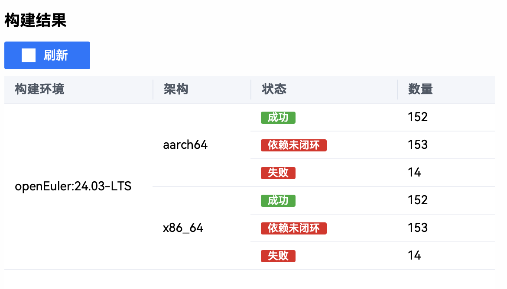
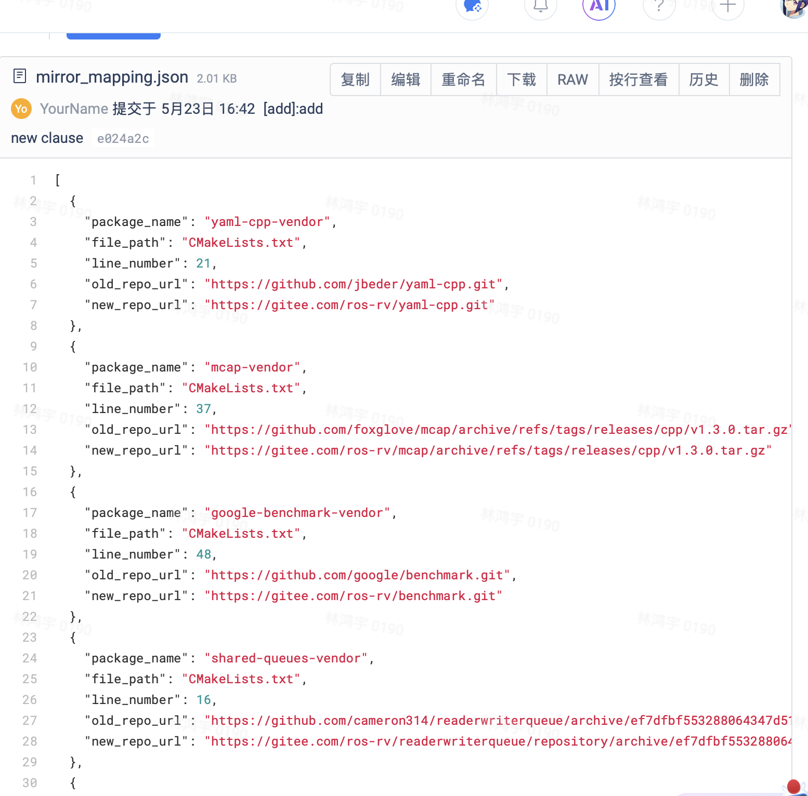

# 五月产出汇总

## 打包

新增 aarch64 软件包 152 个（更新日期：5/26），这里是 eulermaker [界面](https://eulermaker.compass-ci.openeuler.openatom.cn/project/overview?osProject=desktop_ros_jazzy_2nd)。



## ROS 生态调研以及文档

新增 ROS 生态软件包获取相关的报告，链接如下：

- [distribution.yaml](https://gitee.com/microseyuyu/oe_jazzy_docs/blob/master/Research/distribution.yaml.md)
- [ros2.repo](https://gitee.com/microseyuyu/oe_jazzy_docs/blob/master/Research/ros2.repo.md)
- [rosinstall_generator](https://gitee.com/microseyuyu/oe_jazzy_docs/blob/master/Research/rosinstall_generator.md)


## 维护

为 ROT 工具维护了一个 `.json` 清单能够让 ROT 工具自动检测相关包已经对应文件中的 GitHub 链接并且自动 patch。

[mirror_mapping.json](https://gitee.com/ros-rv/rosopeneulertool/raw/main/ros_openeuler_tool/mappings/mirror_mapping.json)



工作说明：

> 该清单首先是根据 eulermaker 构建任务结束后的日志文件人工查看的错误链接，并且在对应的软件包找到对应无法解析的链接并且使用新开发的脚本整理成 `.json` 文件，并且打上 patch。
任务复杂程度可以参考 eulermaker 的构建历史：
- [desktop_ros_jazzy_1st](https://eulermaker.compass-ci.openeuler.openatom.cn/project/build?osProject=desktop_ros_jazzy_1st)
- [desktop_ros_jazzy_2nd](https://eulermaker.compass-ci.openeuler.openatom.cn/project/build?osProject=desktop_ros_jazzy_2nd)

**新增 rosdep 条目**：
对应 commit，请点击[这里](https://gitee.com/microseyuyu/oe_jazzy_docs/commit/27391847f2ff51dec630437da085ee74a55d3256)
新增如下：

```
# base
libboost-python-dev:
  openeuler: [boost-python3]
libboost-dev:
  openeuler: [boost-devel]
libpcl-all-dev:
  openeuler: [pcl, pcl-devel]
libpcl-io:
  openeuler: [pcl, pcl-devel]
libglew-dev:
  openeuler: [glew-devel]
libpcl-common:
  openeuler: [pcl, pcl-devel]
sdl2:
  openeuler: [SDL2, SDL2-devel]

# python
python3-opencv:
  openeuler: [opencv]
python3-deprecated:
  openeuler: [python3-deprecated]
libboost-python:
  openeuler: [boost-python3]
python3-pygraphviz:
  openeuler: [python3-graphviz]
```

对应更新 commit 请查看[这里](https://gitee.com/microseyuyu/oe_jazzy_docs/commits/05e3d19816f52173c57bd0a0249343a03ac1ca63)。


## ROT 工具功能更新

ROT 工具更新功能：

- 自动扫描当前文件夹下的 GitHub 链接并且做成 json 文件 -> make_manifest.py
- 自动给有 GitHub 链接问题的包进行自动 patch -> patch_urls.py

更新脚本：

- [make_manifest.py](https://e.gitee.com/ros-rv/projects/736380/repos/ros-rv/rosopeneulertool/blob/main/ros_openeuler_tool%2Fmake_manifest.py)
- [patch_urls.py](https://e.gitee.com/ros-rv/projects/736380/repos/ros-rv/rosopeneulertool/blob/main/ros_openeuler_tool%2Fpatch_urls.py)

调整工具内一些早期脚本到 legacy，仅保留核心功能。

## 下一步计划 

1. 继续打包
2. 根据与 oerv 相关的 staff 对接后了解，目前使用的构建工具是 tarsier OBS，与汪洋老师进一步对接了解可以有办法让 eulermaker 的 rv 软件包构建上传日志，但是需要时间。
3. 将 ROT 工具做最后的功能确定，并且在用户环境下测试并发布