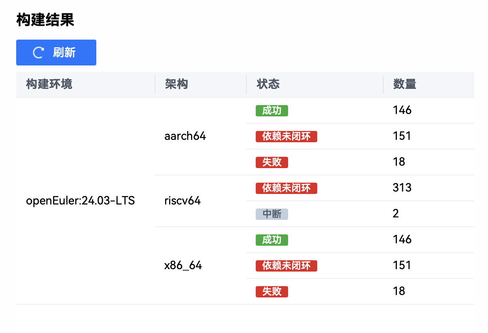

# 五月产出汇总

## 打包

新增 aarch64 软件包 146 个（更新日期：5/26），eulermaker [界面](https://eulermaker.compass-ci.openeuler.openatom.cn/project/overview?osProject=desktop_ros_jazzy_1st)

## ROS 生态调研以及文档

新增 ROS 生态软件包获取相关的调研，

## 维护

为 ROT 工具维护了一个 `.json` 清单能够让 ROT 工具自动检测相关包已经对应文件中的 GitHub 链接并且自动 patch。

[mirror_mapping.json](https://gitee.com/ros-rv/rosopeneulertool/raw/main/ros_openeuler_tool/mappings/mirror_mapping.json)

## ROT 工具功能更新

ROT 工具更新功能：

- 自动扫描当前文件夹下的 GitHub 链接并且做成 json 文件 -> make_manifest.py
- 自动给有 GitHub 链接问题的包进行自动 patch -> patch_urls.py

更新脚本：

- [make_manifest.py](https://e.gitee.com/ros-rv/projects/736380/repos/ros-rv/rosopeneulertool/blob/main/ros_openeuler_tool%2Fmake_manifest.py)
- [patch_urls.py](https://e.gitee.com/ros-rv/projects/736380/repos/ros-rv/rosopeneulertool/blob/main/ros_openeuler_tool%2Fpatch_urls.py)

调整工具内一些早期脚本到 legacy，仅保留核心功能。

## 下一步计划 

1. 等 eulermaker 可以正常工作，继续打包
2. 等服务器可以连接，测试 ROT
3. 测试不同 aarch64 以及 rv 的包
4. 上传本地文档