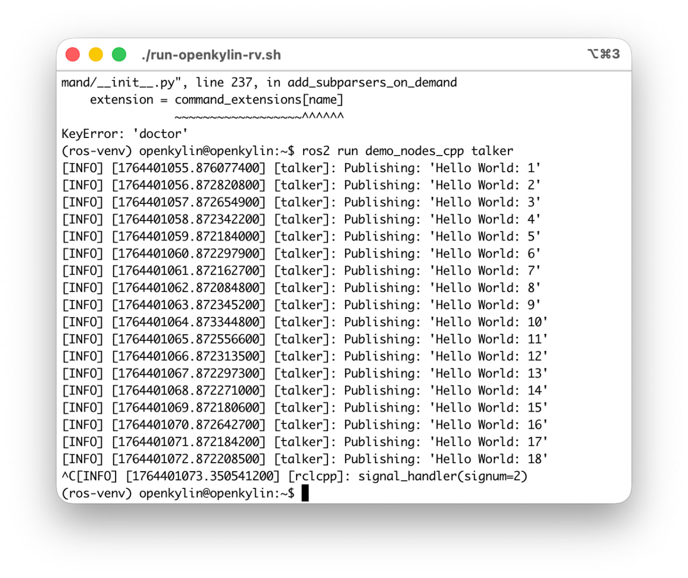

# 十一月产出

## openEuler 打包工具及文档

> 本月新产出了极简化 spec 生成流水线，使用新脚本工具替代原先的 rot 工具，在原来的基础上简化了打包的流程，提高打包效率。

本月新产出的工具是在原先 rot 工作流的基础上进一步的提升了从 0 到上传 eulermaker 的工作流效率，简化到了如下步骤：

**准备环境 -> 生成 tarball -> 生成 spec -> spec 规范 -> 上传 gitee**

对应的产出了如下新的脚本：

```
➜  tools git:(main) ✗ ls scripts
delete_all_gitee_repos.py gen_tarballs.py           run_pipeline.py
fix_specs.py              gen_template_specs.py     upload_to_gitee.py
```

文档中详细讲述了工具脚本的作用，这里不多阐述。

参阅[打包流水线](https://github.com/Sebastianhayashi/ROS-Porting/blob/main/openEuler_Jazzy/Pipline.md)查看具体工作流信息。

同时新增了具体包问题，在 eulermaker 打包过程中会遇到的特殊包情况都开始收录至[具体包问题](https://github.com/Sebastianhayashi/ROS-Porting/blob/main/openEuler_Jazzy/Package_issue.md)。便于后续打包工作不再继续踩坑。

## openKylin qemu 镜像

> 根据李程的要求，产出了：openkylin 2.0 sp2 带桌面的 qcow2 riscv64 镜像，并且附带启动脚本以及说明，同时内置 colcon 构建完成的 ros jazzy desktop 软件包。

产出内容：

```
➜  openkylin_qcow tree
.
├── Image-ok2-rv -> 内核镜像
├── initrd-ok2-rv.img -> initrd/initramfs
├── openkylin-2.0-sp2-rv.qcow2 -> 镜像
└── run-openkylin-rv.sh -> 启动脚本

1 directory, 4 files
```

成功启动 ROS 并启动测试：



## eigen 测试

> 在最新的 patch（rvv-mr2030）下对比在 openEuler 以及 bianbuOS 上的 eigen3 带 patch 与官方版的性能区别。

具体产出为，具体产出见仓库[eigen-compare](https://github.com/Sebastianhayashi/eigen-compare)：

1. 测试设计
2. 测试过程 
3. 测试产出数据（.dat + means 图）
4. 测试结果分析

目前该项目的情况属于是处于调研测试阶段，一开始想要把所有的测试都调研清楚是做什么的，但是这么做工作量巨大且没有意义，我们的目的是为了加速 cartographer 而不是为了给 eigen3 做优化，所以需要调研的是首先 cartographer 以来 eigen3 的哪些部分，根据这些部分去针对性的做优化，而不是单纯看所有基准测试的提升性能，我们不做产品宣发所以 eigen3 的加速数据没有意义。

所以方向为先从 cartographer 下手，调研 eigen3 具体哪些部分相关，再从相关的测试切入。

目前资料混杂且复杂所以还没有写成文档，但是目前已知需要重点：

- GEMM 类 + 高阶分解
- Triangular solve + Matrix–Vector
- AXPY/AXPBY/ROT 等 Level-1

> 上面说的重点是一开始单纯从 RVV 向量加速的角度而言做的调研，后续跟顾嘉祺开会完后重新确定方向去从 Cartographer 的角度出发调研。

姑且在读[Algorithms and optimization techniques for high-performance matrix-matrix multiplications of very small matrices](https://www.sciencedirect.com/science/article/abs/pii/S0167819118301091)（这是一片关于高性能计算论文），大体上的内容说的是只要把科学计算尽量表达成 BLAS 尤其是 GEMM（矩阵–矩阵乘），再针对目标架构把 GEMM 内核做到极致，就能在各种 CPU 上获得“可移植的高性能“。

后续这些内容会一起整理起来，分析讲述如何从 cartographer 的角度优化 eigen3 性能，这个月时间来不及了。

## Cartographer 测试

目前 cartographer 正在编译中，遇到了 absl 的问题正在尝试跟顾嘉祺解决这个问题。

具体参见 [cartographerr_test](https://github.com/Sebastianhayashi/Cartographer_test/tree/main) 仓库下的 README 文档。

## OBS 使用文档

产出了 OBS 使用的详细[更进一步的使用 OBS](https://github.com/Sebastianhayashi/ROS-Porting/blob/main/Building_platform/How_to_use_OBS.md)。

该文档在原先的基础上讲述了如何使用 OBS 进行具体的打包工作。

