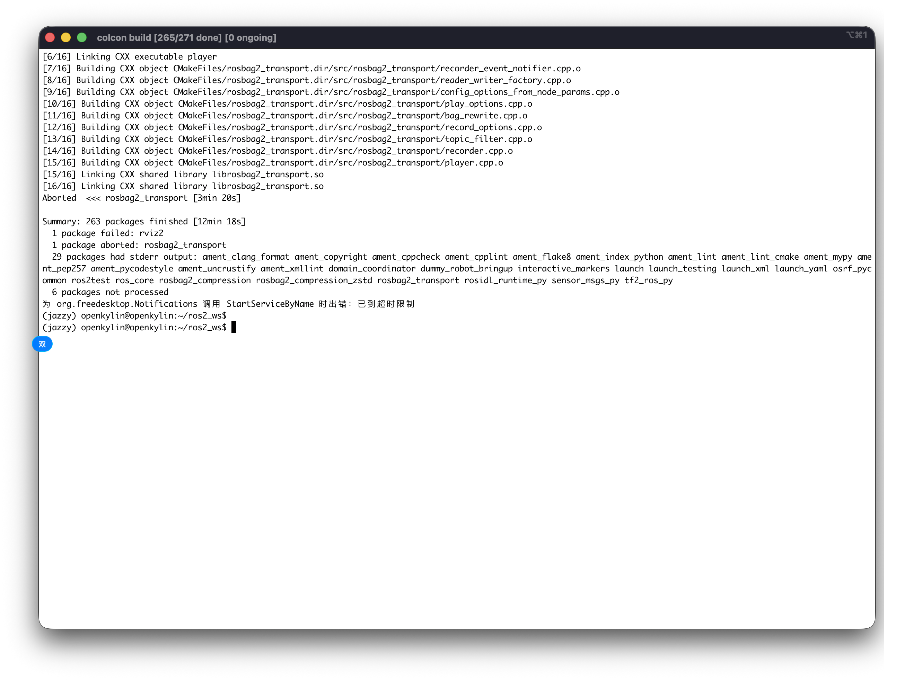

# 九月产出

## OBS 使用文档

1. 如何使用 OBS 网页端 -> https://github.com/Sebastianhayashi/ROS-Porting/blob/main/Building_platform/Create%20_project_on_OBS.md
2. 如何使用 OBS 命令行 -> https://github.com/Sebastianhayashi/ROS-Porting/blob/main/Building_platform/OBS_Cli.md

## openEuler 24.03 LTS ROS Jazzy 移植

前半个月的工作主要是在对其与韩老师那边的规范，但是他们的规范在变动且没有定数所以我也在动态的调整我的规范。后半个月的工作主要是在往官方规范外加**精简工作流**的方向重新调整规范以及脚本工具。

主要调整调整内容为：将 spec 中的多余的补丁使用构建工具如 eulermaker 自身去实现，给 spec 打极小补丁以适应 openeuler。

同时在将整个构建流程撰写成文档。这么做的好处是在于后续为 openEuler ROS 做贡献的人可以更加简单高效的去复用这个工作流，提供一个与 openEuler 社区不同的思路参考。

## 外部可见产出说明

仓库链接：https://github.com/Sebastianhayashi/ROS-Porting

```
ROS-Porting git:(main) tree
.
├── Building_platform
│   ├── Create _project_on_OBS.md -> 新增内容
│   ├── img -> 新增内容
│   │   ├── Add_file.png
│   │   ├── Add_Repository_to.png
│   │   ├── Build_repo.png
│   │   ├── Build_Result.png
│   │   ├── configured.png
│   │   ├── Create_for.png
│   │   ├── Create_subproject.png
│   │   ├── Create_Successful.png
│   │   ├── Creating_Package.png
│   │   ├── Default_Project.png
│   │   ├── Home_Project.png
│   │   ├── Repo_Configure.png
│   │   ├── Sources.png
│   │   └── subproject.png
│   ├── OBS_Cli.md -> 新增内容
│   └── repositories.png
├── openEuler_humble
│   ├── all
│   │   ├── buildrequire_list.json
│   │   └── README.md
│   ├── README.md
│   └── Scripts
│       ├── extract_buildrequires.py
│       ├── tools
│       │   ├── import_srpms_single
│       │   │   ├── import_srpms_single.sh
│       │   │   └── README.md
│       │   └── verify_srpm_on_lpi4a
│       │       ├── build_order.sh
│       │       ├── gen_build_order.py
│       │       └── rebuild_and_install.py
│       └── verify_packages.py
├── openEuler_Jazzy
│   ├── eulermaker_issue.md -> 新增
│   ├── generate_spec.md -> 新增
│   ├── README.md -> 新增
│   ├── Source_Management.md -> 新增
│   └── Sources.md -> 新增
├── openKylin_Jazzy
│   ├── img
│   │   └── ok_turtlesim.png
│   ├── Porting_Plan.md
│   ├── README.md
│   ├── results
│   │   ├── apt_verify_search
│   │   │   └── apt_search_report_20250728_164425.md
│   │   ├── extract_buildrequires
│   │   │   └── buildrequire_list_raw.json
│   │   ├── README.md
│   │   └── verify_packages
│   │       └── buildrequire_list.json
│   ├── ros_core
│   │   └── buildrequire_list_raw.json
│   └── tools
│       ├── apt_verify_search.py
│       ├── deb_build
│       │   ├── bloom_batch_generate.sh
│       │   ├── gen-dsc.sh
│       │   ├── gen-orig.sh
│       │   ├── orchestrate-sbuild-repo.sh
│       │   └── repo-init.sh
│       ├── extract_buildrequires.py
│       ├── scan_rosdep.sh
│       └── verify_packages.py
├── README.md
└── Verification_Scheme_for_System-Level_Dependency.md

19 directories, 51 files
```

## eigen 库测试对比

按照顾嘉祺的[文档](https://note.cd.al/zh-CN/notes/Operating%20System/rvv-benchmark/eigen3-riscv-rvv1-benchmark.html)中的内容，该测试聚焦于对比 eigen 库在启用了 RVV 加速补丁以及官方无补丁版本两者跑 bench 测试的性能差距。

官方版可以正确构建 bench/btl 下的所有的测试，但是 RVV 加速版本只能构建四个基准测试，即使是基准测试的情况下也相对耗时（四个测试至少需要六个小时）。

前半个月的工作主要是在查询各种文档以及根据编译器的错误调整测试的方案等，后半个月的工作是在对比两者之间四个基准测试的性能差异，并且**产出 means 图**作为对比，更详细的内容参见这里。

本月主要可见外部[产出](https://github.com/Sebastianhayashi/eigen_test.git)：

```
➜  eigen_test git:(main) ✗ tree
.
├── README.md
└── tests
    ├── builds
    │   ├── build-official.tar.gz
    │   └── build-rvv.tar.gz
    └── means
        ├── official
        │   ├── aat.jpg
        │   ├── atv.jpg
        │   ├── axpby.jpg
        │   ├── axpy.jpg
        │   ├── cholesky.jpg
        │   ├── ger.jpg
        │   ├── matrix_matrix.jpg
        │   ├── matrix_vector.jpg
        │   ├── partial_lu_decomp.jpg
        │   ├── rot.jpg
        │   ├── symv.jpg
        │   ├── syr2.jpg
        │   ├── tridiagonalization.jpg
        │   ├── trisolve_matrix.jpg
        │   ├── trisolve_vector.jpg
        │   └── trmm.jpg
        └── rvv
            ├── aat.jpg
            ├── atv.jpg
            ├── axpby.jpg
            ├── axpy.jpg
            ├── cholesky.jpg
            ├── ger.jpg
            ├── matrix_matrix.jpg
            ├── matrix_vector.jpg
            ├── partial_lu_decomp.jpg
            ├── rot.jpg
            ├── symv.jpg
            ├── syr2.jpg
            ├── tridiagonalization.jpg
            ├── trisolve_matrix.jpg
            ├── trisolve_vector.jpg
            └── trmm.jpg

6 directories, 35 files
```

上面的仓库中目前产出了一部分的文档（README），以及跑出来的结果（即 .dat 文件），以及 means 图（即 .jpg 文件）。

## openkylin 打包

目前 riscv 核心包都已经编译出来了，如下图：



但是由于目前 openkylin 没有官方的 qemu 镜像，现在 qemu 上跑的是 unmatched 的景象，所以内核也是自己编译的，在开启桌面环境的时候出现了问题，目前还没有解决桌面问题，所以还没有办法演示小乌龟。

核心包以及 turtlsim 都通过了 colcon 编译验证出来了。如图成功构建软件包数量：**263**